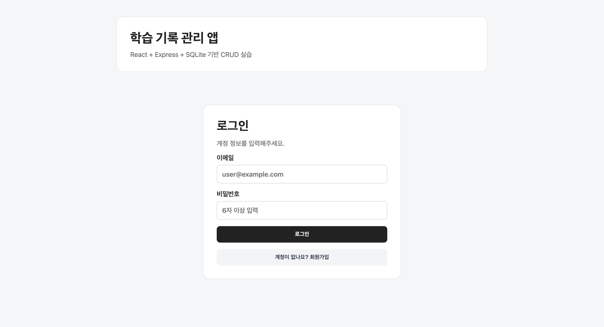
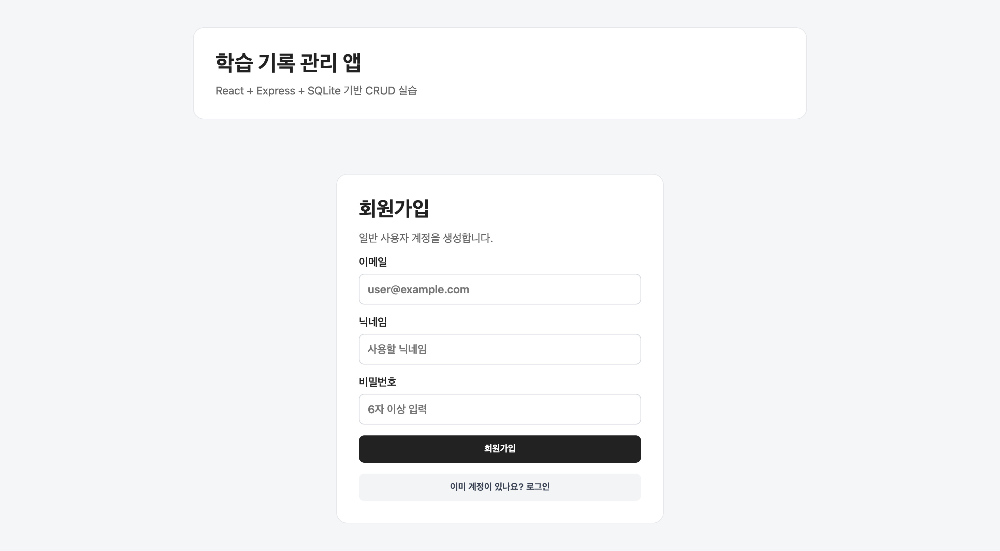
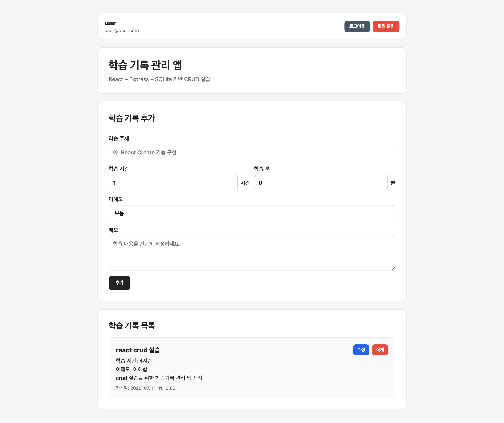
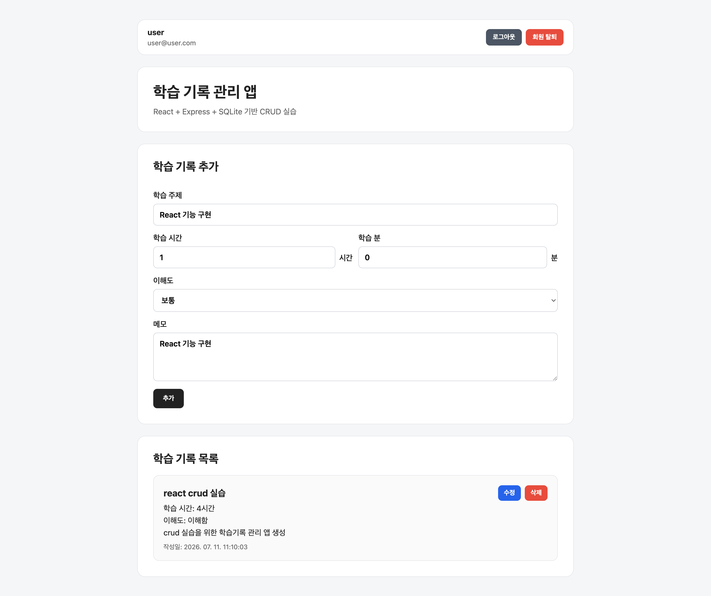
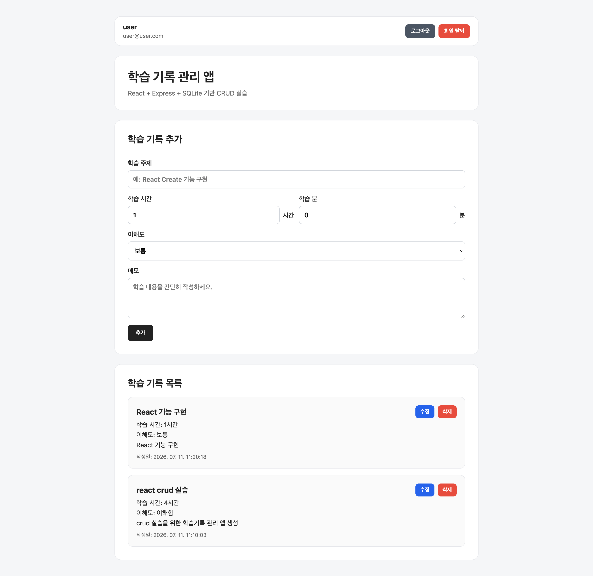
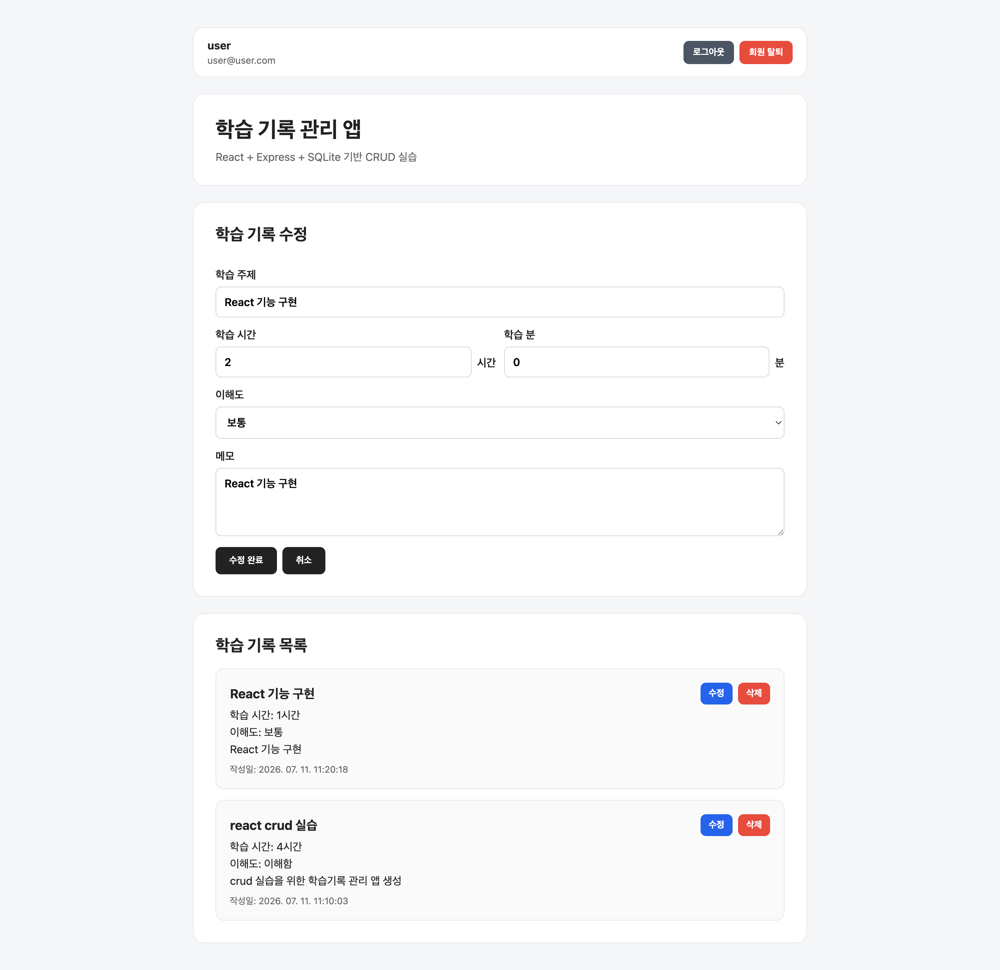
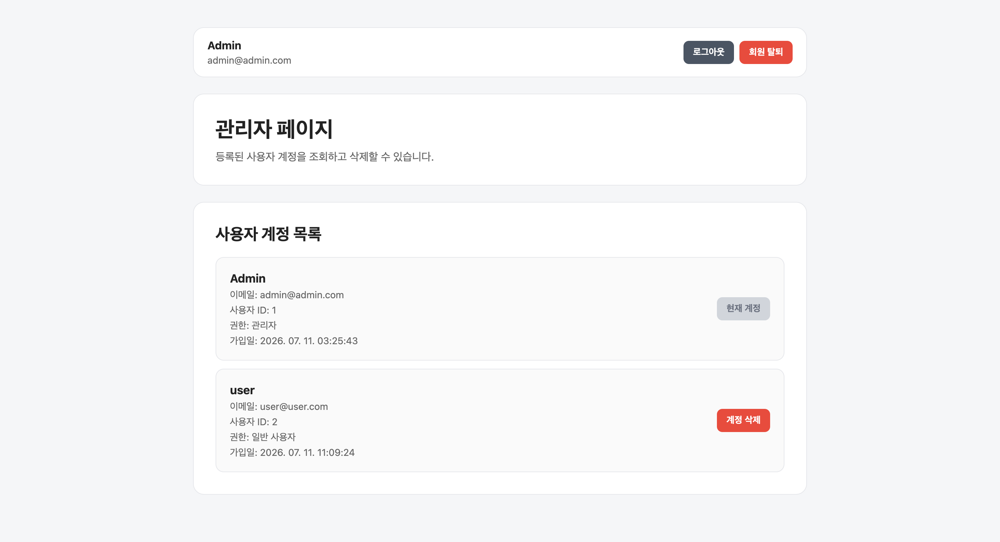
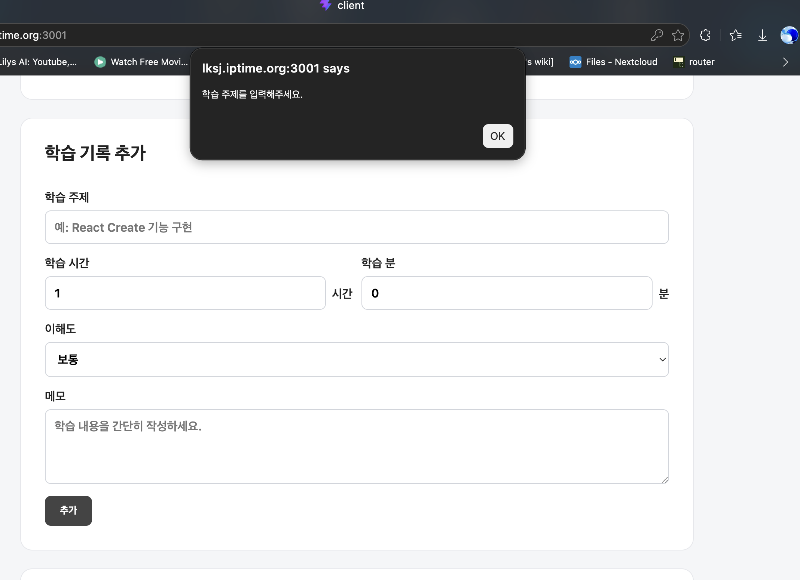

# 과제5 README

> 과제명: 리액트를 이용해서 CRUD 앱 만들기  
> 프로젝트 폴더명: `crud_practice`  
> 최종 문서 수정일: 2026-07-11

---

## 1. 프로젝트 개요

| 항목 | 내용 |
|---|---|
| 과정명 | AI SW 장기교육 |
| 과제 번호 | 과제 5 |
| 프로젝트명 | 학습 기록 관리 앱 |
| 한 줄 소개 | 일반 사용자는 본인의 학습 기록을 관리하고, 관리자는 사용자 계정을 관리하는 React 기반 CRUD 앱 |
| 프론트엔드 | React + Vite |
| 백엔드 | Node.js + Express |
| 데이터베이스 | SQLite + better-sqlite3 |
| 인증 | JWT + bcryptjs |
| 권한 | `admin` / `user` 역할 기반 미들웨어 검증 |
| 데이터 저장 | `data/study.db` |
| 표시 시간대 | DB에는 UTC로 저장하고 화면에서는 `Asia/Seoul`로 변환 |
| GitHub 링크 | https://github.com/lksj12/live_challenge/live_challenge5 |
| 실행 또는 배포 링크 | lksj.iptime.org:3001 |

### 수행 수준

| 구분 | 선택 | 구현 내용 |
|---|:---:|---|
| 초급 | ☑ | Read/Create/Update/Delete 구현 |
| 표준 | ☑ | 컴포넌트·페이지·훅·API 모듈 분리, 입력 검증, 로딩·빈 상태·오류 처리 |
| 심화 | ☑ | Express + SQLite + JWT 인증, 토큰 폐기, 역할 분리, 사용자별 데이터 제한 |

---

## 2. 최종 구현 기능

### 2-1. 인증 및 계정

- 이메일, 닉네임, 비밀번호 기반 회원가입
- 이메일과 비밀번호 기반 로그인
- bcryptjs 비밀번호 해싱
- JWT 발급 및 `Authorization: Bearer <token>` 인증
- 새로고침 시 `/api/auth/me`를 통한 로그인 상태 복원
- 로그아웃 시 JWT의 `jti`를 `revoked_tokens` 테이블에 저장하여 재사용 차단
- 회원 탈퇴 시 사용자와 해당 사용자의 학습 기록 삭제
- 일반 회원가입 API에서는 항상 `user` 역할로 생성
- 관리자 계정은 `npm run create-admin` 스크립트로만 생성
- 관리자 닉네임은 `Admin`으로 고정
- 일반 사용자는 `Admin` 닉네임 사용 불가

### 2-2. 일반 사용자 기능

- 본인의 학습 기록 목록 조회
- 학습 기록 추가
- 학습 기록 수정
- 학습 기록 삭제
- 학습 시간은 화면에서 시간/분으로 입력하고 DB에는 총 분으로 저장
- 학습 기록 조회·수정·삭제 시 `user_id` 조건으로 다른 사용자의 데이터 접근 차단

### 2-3. 관리자 기능

- 전체 사용자 계정 목록 조회
- 일반 사용자 계정 삭제
- 관리자 자신의 계정은 관리자 삭제 API로 삭제 불가
- 관리자는 학습 기록 CRUD 화면에 접근하지 않음
- 사용자 목록에서 닉네임, 이메일, ID, 권한, 가입일 확인

### 2-4. 화면 및 사용성

- 로그인/회원가입 모드 전환
- 모드 전환 시 이메일·비밀번호·닉네임 입력값 초기화
- 사용자 헤더에 닉네임과 이메일 표시
- 로딩·빈 목록·오류 상태 표시
- 학습 기록 수정 시 `key`를 이용해 폼을 재마운트
- SQLite UTC 시간을 프론트에서 한국 시간으로 변환해 표시
- 모바일 화면 대응 CSS 적용

---

## 3. 화면 캡처

| 화면 | 상태 |
|---|---|:---:|
| 로그인 | |
| 회원가입 |  |
| 일반 사용자 로그인 후 |  |
| 일반 사용자 학습 기록 |  |
| 학습 기록 추가 |  |
| 학습 기록 수정 중 |  |
| 학습 기록 수정 완료 |  |
| 관리자 사용자 관리 |  |
| 오류 또는 빈 상태 |  |

---

## 4. 실행 방법

### 4-1. 사전 준비

```bash
node -v
npm -v
```

### 4-2. 백엔드 환경변수 설정

`server/.env` 파일을 생성합니다.

```env
PORT=3000
JWT_SECRET=충분히_길고_예측하기_어려운_문자열
CLIENT_URL=http://localhost:5173

ADMIN_EMAIL=admin@example.com
ADMIN_PASSWORD=관리자_초기_비밀번호
```

주의사항:

- `.env`는 GitHub에 업로드하지 않습니다.
- `ADMIN_PASSWORD`는 관리자 생성 후 `.env`에서 삭제하는 것이 좋습니다.
- 실제 비밀번호나 JWT secret은 README와 캡처에 기록하지 않습니다.

### 4-3. 관리자 계정 생성

백엔드 서버가 실행되기 전에도 실행할 수 있습니다.

```bash
cd server
npm install
npm run create-admin
```

스크립트가 `db.js`를 직접 불러오므로 DB 파일과 테이블이 없으면 자동 생성됩니다.

관리자 생성이 끝나면 `.env`에서 `ADMIN_PASSWORD`를 삭제할 수 있습니다.

### 4-4. 백엔드 실행

```bash
cd server
npm run dev
```

상태 확인:

```bash
curl http://localhost:3000/api/health
```

### 4-5. 프론트엔드 실행

```bash
cd client
npm install
npm run dev
```

브라우저:

```text
http://localhost:5173
```

> 개발 환경에서 프론트와 백엔드 포트가 분리되어 있다면 현재 프로젝트의 Vite proxy 또는 API base URL 설정이 실제 코드와 일치하는지 확인합니다.

### 4-6. 최종 빌드 후 Express에서 실행

```bash
cd client
npm run build

cd ../server
npm run dev
```

브라우저:

```text
http://localhost:3000
```

---

## 5. 데이터베이스 구조

### 5-1. `users`

| 컬럼 | 자료형 | 제약/기본값 | 설명 |
|---|---|---|---|
| `id` | INTEGER | PK, AUTOINCREMENT | 사용자 ID |
| `email` | TEXT | NOT NULL, UNIQUE | 로그인 이메일 |
| `password_hash` | TEXT | NOT NULL | bcryptjs 해시 |
| `nickname` | TEXT | NOT NULL | 사용자 닉네임 |
| `role` | TEXT | `user`/`admin` CHECK | 사용자 권한 |
| `created_at` | TEXT | CURRENT_TIMESTAMP | 계정 생성 시각(UTC) |

### 5-2. `studies`

| 컬럼 | 자료형 | 제약/기본값 | 설명 |
|---|---|---|---|
| `id` | INTEGER | PK, AUTOINCREMENT | 학습 기록 ID |
| `user_id` | INTEGER | NOT NULL, FK | 작성자 사용자 ID |
| `title` | TEXT | NOT NULL | 학습 주제 |
| `study_minutes` | INTEGER | NOT NULL, 기본 0 | 총 학습 시간(분) |
| `understanding` | TEXT | NOT NULL, 기본 `보통` | 이해도 |
| `memo` | TEXT | NOT NULL, 기본 빈 문자열 | 메모 |
| `created_at` | TEXT | CURRENT_TIMESTAMP | 생성 시각(UTC) |
| `updated_at` | TEXT | CURRENT_TIMESTAMP | 수정 시각(UTC) |

외래키:

```sql
FOREIGN KEY (user_id)
REFERENCES users(id)
ON DELETE CASCADE
```

### 5-3. `revoked_tokens`

| 컬럼 | 자료형 | 제약 | 설명 |
|---|---|---|---|
| `jti` | TEXT | PRIMARY KEY | 폐기한 JWT의 고유 ID |
| `expires_at` | INTEGER | NOT NULL | 토큰 만료 Unix timestamp |

---

## 6. API

### 인증

| 메서드 | 경로 | 권한 | 설명 |
|---|---|---|---|
| POST | `/api/auth/signup` | 공개 | 일반 사용자 회원가입 |
| POST | `/api/auth/login` | 공개 | 로그인 및 JWT 발급 |
| GET | `/api/auth/me` | 로그인 | 현재 사용자 정보 |
| POST | `/api/auth/logout` | 로그인 | 현재 JWT 폐기 |
| DELETE | `/api/auth/me` | 로그인 | 회원 탈퇴 |

### 학습 기록

| 메서드 | 경로 | 권한 | 설명 |
|---|---|---|---|
| GET | `/api/studies` | user | 본인 학습 기록 조회 |
| POST | `/api/studies` | user | 학습 기록 추가 |
| PUT | `/api/studies/:id` | user | 본인 기록 수정 |
| DELETE | `/api/studies/:id` | user | 본인 기록 삭제 |

### 관리자

| 메서드 | 경로 | 권한 | 설명 |
|---|---|---|---|
| GET | `/api/admin/users` | admin | 전체 사용자 조회 |
| DELETE | `/api/admin/users/:id` | admin | 대상 사용자 삭제 |

---

## 7. 최종 폴더 구조

```text
crud_practice/
├─ README.md
├─ client/
│  ├─ index.html
│  ├─ package.json
│  ├─ vite.config.js
│  └─ src/
│     ├─ api/
│     │  ├─ http.js
│     │  ├─ authApi.js
│     │  ├─ studyApi.js
│     │  └─ adminApi.js
│     ├─ components/
│     │  ├─ AuthForm.jsx
│     │  ├─ StudyCard.jsx
│     │  ├─ StudyForm.jsx
│     │  ├─ StudyList.jsx
│     │  ├─ UserCard.jsx
│     │  ├─ UserHeader.jsx
│     │  └─ UserList.jsx
│     ├─ hooks/
│     │  ├─ useAuth.js
│     │  ├─ useStudies.js
│     │  └─ useUsers.js
│     ├─ pages/
│     │  ├─ AdminPage.jsx
│     │  ├─ AuthPage.jsx
│     │  └─ StudyPage.jsx
│     ├─ utils/
│     │  ├─ dateUtils.js
│     │  ├─ studyUtils.js
│     │  └─ tokenStorage.js
│     ├─ App.jsx
│     ├─ App.css
│     ├─ index.css
│     └─ main.jsx
├─ server/
│  ├─ middleware/
│  │  ├─ requireAdmin.js
│  │  ├─ requireAuth.js
│  │  └─ requireUser.js
│  ├─ models/
│  │  ├─ studyModel.js
│  │  ├─ tokenModel.js
│  │  └─ userModel.js
│  ├─ routes/
│  │  ├─ adminRoutes.js
│  │  ├─ authRoutes.js
│  │  └─ studyRoutes.js
│  ├─ scripts/
│  │  └─ createAdmin.js
│  ├─ utils/
│  │  └─ token.js
│  ├─ .env
│  ├─ db.js
│  ├─ index.js
│  └─ package.json
├─ data/
│  └─ study.db
└─ screenshots/
   └─ <!-- TODO: 제출용 화면 캡처 -->
```

---

## 8. 보안 설계 요약

- 비밀번호는 평문으로 저장하지 않고 bcryptjs로 해싱합니다.
- 공개 회원가입은 항상 `user` 역할로 생성됩니다.
- 관리자 계정은 로컬 관리자 생성 스크립트로만 만듭니다.
- 프론트의 역할 정보만 신뢰하지 않고 백엔드 미들웨어에서 JWT와 역할을 검증합니다.
- 학습 기록 수정·삭제는 `id`와 `user_id`를 함께 조건으로 사용합니다.
- 로그아웃한 JWT는 `jti` 블랙리스트로 재사용을 차단합니다.
- CORS는 `CLIENT_URL`로 허용 출처를 제한합니다.
- `.env`, `study.db`, 실제 토큰 및 비밀번호는 공개 저장소에서 제외합니다.

알려진 한계:

- Access Token을 `localStorage`에 저장하므로 XSS 방어가 중요합니다.
- 관리자에 의해 사용자가 삭제되더라도 해당 사용자의 모든 기존 토큰을 사용자 단위로 일괄 폐기하는 기능은 없습니다.
- HTTPS, rate limiting, 비밀번호 재설정, 이메일 인증은 과제 범위에 포함하지 않았습니다.

---

## 9. AI 활용 및 사람의 검토

| 단계 | AI 활용 | 사람이 검토·수정한 내용 |
|---|---|---|
| 주제 선정 | CRUD 예제 추천 | 학습 기록 관리 앱으로 확정 |
| 저장 구조 | React + Express + SQLite 제안 | 제출 폴더 재현성과 다중 접속 요구를 반영 |
| CRUD | API·폼·목록 코드 제안 | 시간/분 입력과 총 분 저장 방식으로 개선 |
| 인증 | JWT, bcryptjs, 미들웨어 제안 | admin/user 역할을 명확히 분리 |
| 관리자 생성 | 공개 가입 방식 검토 | 공개 API가 아닌 일회성 생성 스크립트로 변경 |
| 로그아웃 | 클라이언트 토큰 삭제 방식 검토 | `jti` 기반 서버 revoke 방식 추가 |
| 프론트 구조 | App 중심 코드 분리 제안 | API/컴포넌트/훅/페이지/유틸로 단계별 분리 |
| 날짜 | UTC 표시 문제 분석 | `Asia/Seoul` 화면 변환 적용 |
| 닉네임 | 회원가입 필드와 표시 위치 제안 | 관리자 닉네임 `Admin` 고정 |

---

## 10. 최종 테스트 체크리스트

아래 표는 제출 직전에 실제 결과를 직접 기입합니다.

| 테스트 | 기대 결과 | 최종 결과 |
|---|---|---|
| 관리자 생성 스크립트 | `Admin` 닉네임의 admin 계정 생성 | 정상 작동 |
| 일반 회원가입 | 입력한 닉네임의 user 계정 생성 | 정상 작동 |
| 로그인·새로고침 | 사용자 상태 유지 | 정상 작동 |
| 학습 기록 CRUD | 본인 데이터만 정상 처리 | 정상 작동 |
| user → admin API | 403 | 정상 작동 |
| admin → studies API | 403 | 정상 작동 |
| 로그아웃 토큰 재사용 | 401 | 정상 작동 |
| 회원 탈퇴 | 사용자와 학습 기록 삭제 | 정상 작동 |
| 관리자 사용자 삭제 | 대상 사용자 및 학습 기록 삭제 | 정상 작동 |
| 한국 시간 표시 | UTC 기준보다 +9시간으로 표시 | 정상 작동 |

---