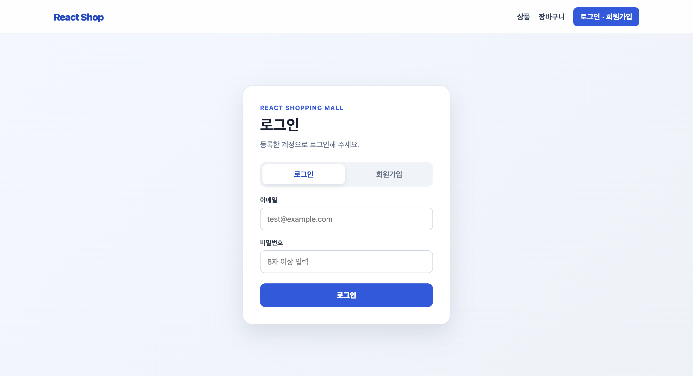
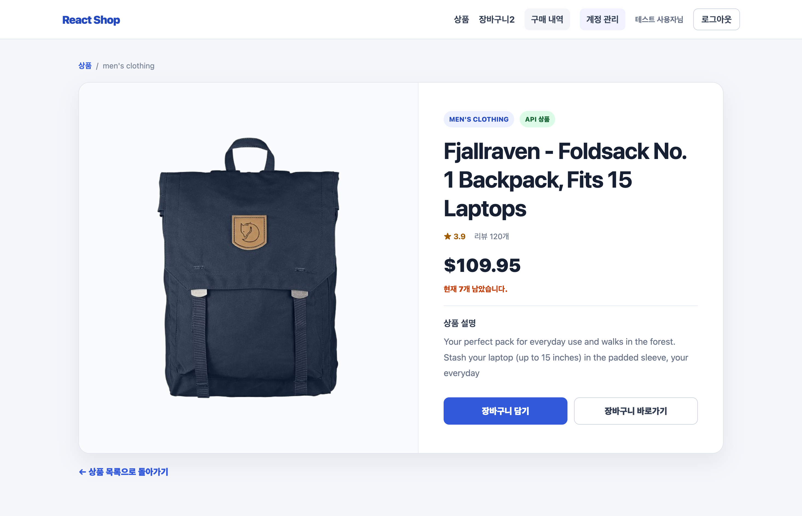
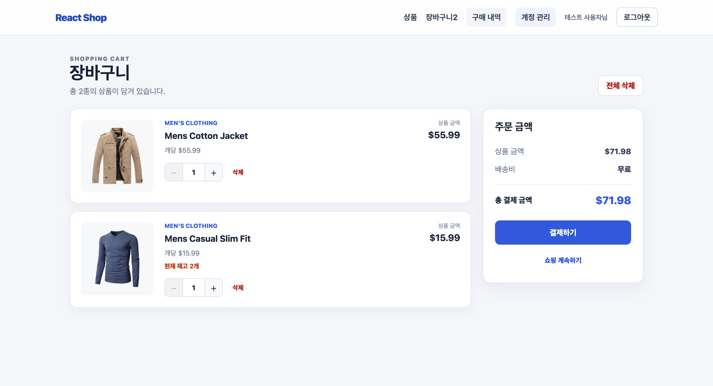
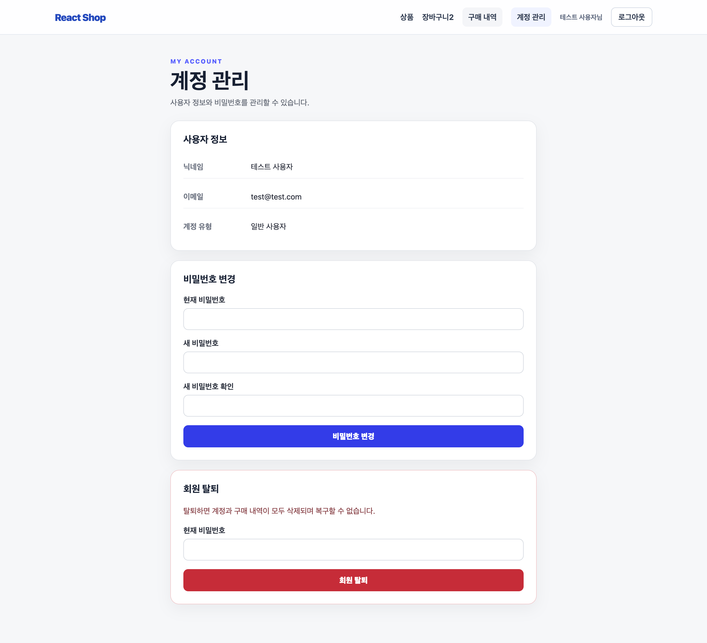
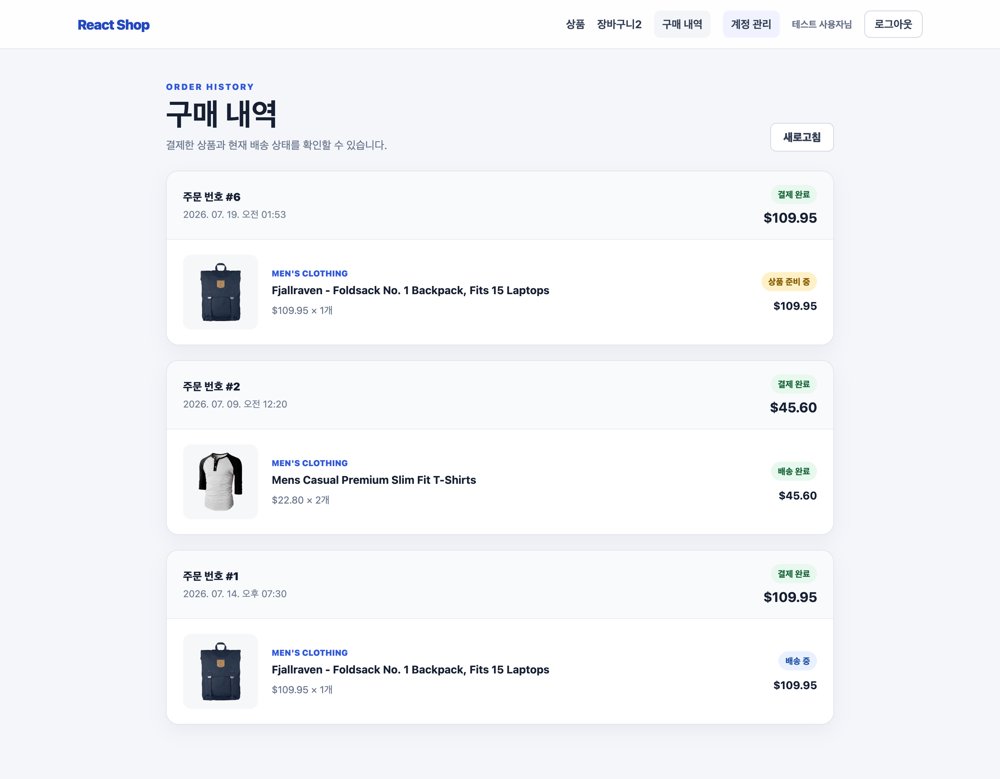
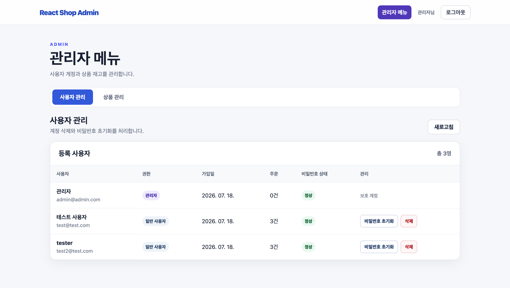
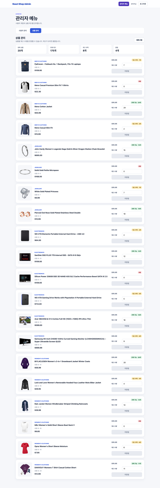

# 과제 6. React 쇼핑몰 앱 만들기 — README 템플릿 v0.3

## 1. 과제 소개

| 항목 | 내용 |
|---|---|
| 과정명 | AI SW 장기교육 |
| 선수 강의 | 따라하며 배우는 리액트 A-Z |
| 핵심 기술 | React, TypeScript, Redux Toolkit, Express, SQLite, bcrypt, JWT |
| 상품 데이터 | Fake Store API + API 실패 시 로컬 mock 대체 |
| 인증·데이터 저장 | Express 자체 인증 + SQLite |
| 결과 예시 | https://drive.google.com/file/d/1fUeCYpSu0H_BU154iN7t1IHM37cDo6mz/view?usp=sharing |

### 한 줄 소개

> 이 프로젝트는 사용자가 상품을 조회·검색하고 장바구니를 관리하며, 로그인 후 모의 결제를 진행하고 구매 내역을 확인할 수 있는 React 쇼핑몰입니다.

### 결과 예시와 다른 점

#### 참고한 기능 흐름

- 상품 목록 및 카테고리 필터
- 상품 상세 정보 조회
- 상품을 장바구니에 추가
- 헤더에서 장바구니 수량 확인
- 장바구니 상품의 수량 변경 및 삭제
- 상품별 금액과 전체 결제 예정 금액 계산
- 장바구니가 비었을 때 안내 화면 표시

#### 다르게 설계한 UI·기능

- 상품명 검색 기능을 추가하였다.
- 상품 조회 과정의 `loading`, `error`, `empty` 상태를 구분하여 표시하였다.
- Fake Store API 요청에 실패하면 동일한 `Product` 구조의 로컬 mock 상품을 사용하도록 구현하였다.
- Firebase 대신 Express, SQLite, bcrypt, JWT를 이용한 자체 회원가입·로그인 기능을 구현하였다.
- 일반 사용자와 관리자의 역할을 구분하고, 역할에 따라 접근 가능한 화면을 분리하였다.
- 비회원과 로그인 사용자의 장바구니를 구분하여 LocalStorage에 저장하고 복원하도록 구현하였다.
- 로그인 시 비회원 장바구니와 기존 회원 장바구니를 병합하거나 덮어쓸 수 있도록 구현하였다.
- 상품 재고를 SQLite에서 관리하고, 관리자 화면에서 상품별 재고를 수정할 수 있도록 구현하였다.
- 상품의 저재고, 품절 및 장바구니 내 재고 부족 상태를 표시하였다.
- 품절 상품에 대한 재입고 알림 신청 기능을 추가하였다.
- 실제 카드 또는 PG 결제는 연동하지 않았으며, 주문 생성과 재고 차감 과정을 확인할 수 있는 학습용 모의 결제 기능을 구현하였다.
- 결제 직전에 서버에서 최신 재고를 다시 검사하고, 주문 생성과 재고 차감을 하나의 SQLite 트랜잭션으로 처리하였다.
- 로그인 사용자가 자신의 구매 내역과 주문 상태를 확인할 수 있도록 구현하였다.
- 비밀번호 변경, 회원 탈퇴, 관리자 비밀번호 초기화 및 사용자 삭제 기능을 추가하였다.

#### 복제하지 않은 이미지·브랜드·문구

- 결과 예시의 `Shop` 로고와 브랜드 표현
- 보라색 아이콘 및 색상 구성
- 빈 장바구니 화면의 일러스트
- 상품 카드와 상세 페이지의 배치
- 버튼의 디자인과 안내 문구
- 결과 예시의 계산 및 장바구니 처리 방식

Fake Store API를 공통으로 사용하기 때문에 일부 상품 이미지와 상품 정보는 결과 예시와 동일할 수 있지만, 화면 구성과 인증·장바구니·재고·관리자·모의 결제 기능은 별도로 설계하였다.

### 실시간 응시와 최종 보완 비교

1시간 종료 시점에는 프로젝트 구조와 기능을 구상하는 단계에 머물렀으며, 실행 가능한 기능이나 비교할 수 있는 화면을 완성하지 못하였다. 이후 최종 제출 기간에 전체 기능과 문서를 구현하였다. 1시간 종료 결과에 대해 별도로 전달받은 수정 또는 보완 사항은 없으므로 보완 내용은 `해당 없음`으로 작성하였다.

| 항목 | 1시간 종료 시 | 최종 제출 시 | 보완 내용 |
|---|---|---|---|
| 데이터·상태·인증 설계 | 완성된 결과 없음 | React, Redux Toolkit, Express, SQLite, JWT 기반 구조 구현 완료 | 해당 없음 |
| 전역 장바구니 | 미구현 | 상품 추가, 수량 변경, 삭제, 총액 계산 및 사용자별 저장 구현 | 해당 없음 |
| 사용자 인증 | 미구현 | 회원가입, 로그인, 인증 상태 복원, 로그아웃 및 계정 관리 구현 | 해당 없음 |
| 상품 API·대체 경로 | 미구현 | Fake Store API 연동, 상태 처리 및 로컬 mock 대체 구현 | 해당 없음 |
| 재고·주문 기능 | 미구현 | SQLite 재고 관리, 모의 결제, 재고 차감 및 구매 내역 구현 | 해당 없음 |
| 관리자 기능 | 미구현 | 사용자 관리 및 상품 재고 관리 기능 구현 | 해당 없음 |
| README·테스트 | 미작성 | README, AI 활용 기록, 오류 해결 기록 및 테스트 결과 작성 | 해당 없음 |

## 2. 실행 화면

| 화면 | 이미지 | 설명 |
|---|---|---|
| 상품 목록·검색 |  | Fake Store API 상품 목록, 상품명 검색, 카테고리 필터 및 재고 상태 |
| 로그인·회원가입 |  | 자체 회원가입·로그인 화면과 로그인 오류 안내 |
| 상품 상세·재고 |  | 상품 상세 정보, 저재고·품절 표시 및 재입고 알림 신청 |
| 장바구니·결제 |  | 상품 수량 변경, 삭제, 총 결제 예정 금액, 재고 부족 안내 및 모의 결제 |
| 계정 관리 |  | 사용자 정보, 비밀번호 변경 및 회원 탈퇴 기능 |
| 구매 내역 |  | 주문별 결제 상태, 배송 상태, 주문 상품과 한국 시간 기준 주문 일시 |
| 관리자 사용자 관리 |  | 사용자 목록, 임시 비밀번호 초기화 및 일반 사용자 삭제 |
| 관리자 상품 관리 |  | 상품별 현재 재고 조회, 재고 수량 변경 및 품절 상태 관리 |

> 실행 화면에는 실제 비밀번호, JWT, 개인정보 또는 실제 결제 정보가 노출되지 않도록 하였다. 테스트 계정의 이메일이 표시되는 경우 과제용 계정만 사용하였다.

## 3. 구현 기능

### 필수 기능

| 기능 | 상태 | 확인 방법 | 비고 |
|---|---|---|---|
| 상품 데이터 조회 또는 mock 대체 | ☑ 완료 | 메인 화면에서 상품 목록이 표시되는지 확인 | Fake Store API 요청 실패 또는 응답 검증 실패 시 로컬 mock 데이터 사용 |
| loading·error·empty 상태 | ☑ 완료 | 상품 로딩 중, API 오류 발생, 검색 결과 없음 상태 확인 | 상태별 안내 화면과 다시 시도 기능 제공 |
| 상품 목록·카드 | ☑ 완료 | 메인 화면에서 상품 이미지, 상품명, 가격과 재고 상태 확인 | 상품 카드를 누르면 상세 페이지로 이동 |
| 전역 상태관리 라이브러리 | ☑ 완료 | 상품·인증·장바구니·재고 상태가 여러 페이지에서 일관되게 표시되는지 확인 | Redux Toolkit과 React Redux 사용 |
| 장바구니 담기·목록 | ☑ 완료 | 상품을 담은 뒤 장바구니 페이지에서 목록 확인 | 같은 상품을 다시 담으면 기존 항목의 수량 증가 |
| 총액 계산 | ☑ 완료 | 장바구니 수량 변경 후 총 결제 예정 금액이 함께 변경되는지 확인 | 상품 가격과 수량을 기준으로 계산 |
| 사용자 로그인 | ☑ 완료 | 회원가입 후 이메일과 비밀번호로 로그인 | Express, SQLite, bcrypt, JWT로 구현 |
| 인증 초기·사용자 상태 | ☑ 완료 | 로그인 후 새로고침하여 로그인 상태가 복원되는지 확인 | 저장된 JWT로 현재 사용자 정보 요청 |
| 로그인 오류·로그아웃 | ☑ 완료 | 잘못된 로그인 정보 입력 및 로그아웃 후 화면 확인 | 오류 메시지 표시, 로그아웃 후 홈 화면 초기화 |

### 권장 기능

| 기능 | 상태 | 설명 |
|---|---|---|
| 수량 변경 | ☑ 완료 | 장바구니에서 상품 수량을 증가·감소할 수 있으며, 현재 재고보다 수량을 많이 늘릴 수 없도록 제한하였다. |
| 항목 삭제 | ☑ 완료 | 장바구니에서 선택한 상품을 개별적으로 삭제할 수 있다. |
| 전체 삭제 | ☑ 완료 | 장바구니의 모든 상품을 한 번에 삭제할 수 있다. |
| 빈 장바구니 안내 | ☑ 완료 | 장바구니에 상품이 없을 때 안내 문구와 상품 목록 이동 버튼을 표시한다. |
| API 다시 시도 | ☑ 완료 | 상품 API 요청 중 오류가 발생하면 오류 안내와 다시 시도 기능을 제공한다. |
| 인증 로딩 UX | ☑ 완료 | 앱을 실행하거나 새로고침했을 때 사용자 인증 상태를 확인하는 동안 로딩 화면을 표시한다. |
| 로그인 전후 UI | ☑ 완료 | 로그인 전에는 로그인·회원가입 메뉴를, 로그인 후에는 사용자 정보와 로그아웃 메뉴를 표시한다. |
| 사용자별 장바구니 | ☑ 완료 | 비회원과 로그인 사용자의 장바구니를 구분하여 저장하고, 같은 사용자가 다시 로그인하면 기존 장바구니를 복원한다. |
| 장바구니 이전 | ☑ 완료 | 비회원 상태에서 담은 상품이 있을 때 로그인 사용자의 기존 장바구니와 병합하거나 덮어쓸 수 있다. |

### 도전 기능

| 기능 | 상태 | 적용 범위·효과 |
|---|---|---|
| TypeScript | ☑ 적용 | 클라이언트와 서버에 적용하여 상품, 인증, 장바구니, 재고, 주문 및 API 데이터의 타입을 관리하였다. |
| 검색 | ☑ 적용 | 상품명을 기준으로 원하는 상품을 검색하고, 검색 결과가 없을 때 별도의 안내를 표시한다. |
| 카테고리 필터 | ☑ 적용 | 전체 상품과 카테고리별 상품을 구분하여 조회할 수 있으며, 검색 기능과 함께 사용할 수 있다. |
| LocalStorage | ☑ 적용 | JWT, 비회원·사용자별 장바구니 및 재입고 알림 신청 상태를 저장하고 복원한다. |
| 수량 배지 | ☑ 적용 | 헤더의 장바구니 메뉴에 담긴 전체 상품 수량을 표시하고 수량 변경 시 즉시 갱신한다. |
| 상품 상세 페이지 | ☑ 적용 | 상품 이미지, 가격, 설명, 카테고리, 평점 및 현재 재고를 별도 페이지에서 확인할 수 있다. |
| 재입고 알림 | ☑ 적용 | 품절 상품에 대해 로그인 사용자별로 재입고 알림을 신청하거나 취소할 수 있다. |
| 반응형·접근성 | ☑ 적용 | 화면 크기에 따라 상품 목록, 상세 페이지와 장바구니 배치를 조정하고 이미지 대체 텍스트와 폼 레이블 등 기본 접근성을 적용하였다. |

### 추가 구현 기능

| 기능 | 상태 | 설명 |
|---|---|---|
| SQLite 상품 재고 관리 | ☑ 완료 | 상품별 재고를 SQLite의 `product_inventory` 테이블에서 관리하고 공용 재고 API를 통해 조회한다. |
| 재고 상태 표시 | ☑ 완료 | 상품 목록, 상세 페이지와 장바구니에서 정상 재고, 저재고, 품절 및 재고 부족 상태를 표시한다. |
| 관리자 재고 수정 | ☑ 완료 | 관리자가 상품별 재고 수량을 수정할 수 있으며 변경값이 일반 사용자와 비회원 화면에도 반영된다. |
| 계정 관리 | ☑ 완료 | 로그인 사용자가 비밀번호를 변경하거나 자신의 계정을 탈퇴할 수 있다. |
| 사용자 역할 구분 | ☑ 완료 | 일반 사용자와 관리자를 구분하고 관리자 전용 화면의 접근 권한을 제한한다. |
| 관리자 사용자 관리 | ☑ 완료 | 관리자가 일반 사용자의 비밀번호를 임시 비밀번호로 초기화하거나 사용자를 삭제할 수 있다. |
| 임시 비밀번호 변경 | ☑ 완료 | 임시 비밀번호로 로그인한 사용자는 계정 화면에서 새 비밀번호를 설정하도록 안내한다. |
| 모의 결제 | ☑ 완료 | 실제 PG나 카드 결제는 연동하지 않고 주문 생성 과정을 확인할 수 있는 학습용 모의 결제를 구현하였다. |
| 결제 전 서버 재고 검증 | ☑ 완료 | 결제 요청 시 서버가 SQLite의 최신 재고를 다시 확인하고 재고가 부족하면 주문을 거부한다. |
| 트랜잭션 기반 재고 차감 | ☑ 완료 | 주문 생성과 재고 차감을 하나의 SQLite 트랜잭션으로 처리하여 일부 작업만 반영되는 문제를 방지한다. |
| 구매 내역 | ☑ 완료 | 로그인 사용자가 자신이 주문한 상품, 수량, 결제 금액, 주문 상태와 주문 시간을 확인할 수 있다. |
| 주문 시간 변환 | ☑ 완료 | SQLite에 저장된 UTC 주문 시간을 화면에서 `Asia/Seoul` 기준 한국 시간으로 변환하여 표시한다. |
| 이미지 fallback | ☑ 완료 | 외부 상품 이미지 로딩에 실패하면 로컬 대체 이미지를 표시한다. |

## 4. 상품 데이터 구조

- 표준 endpoint: `https://fakestoreapi.com/products`
- 실제 사용 경로: Fake Store API를 우선 호출하고, 요청 실패 또는 응답 검증 실패 시 로컬 mock 데이터로 대체
- mock 적용 이유: 외부 API 장애나 잘못된 응답으로 인해 상품 목록 전체를 사용할 수 없게 되는 상황을 방지하기 위해 적용
- 사용한 응답 필드: `id`, `title`, `price`, `description`, `category`, `image`, `rating.rate`, `rating.count`
- 상품 API 처리 위치: `client/src/services`의 상품 API 서비스
- 상품 재고: Fake Store API 응답과 분리하여 서버의 SQLite `product_inventory` 테이블에서 관리
- 공용 재고 조회 API: `GET /api/inventory`
- 관리자 재고 수정 API: `PATCH /api/admin/products/:productId/stock`

상품명, 가격, 설명, 카테고리, 이미지와 평점은 Fake Store API 또는 로컬 mock 데이터에서 가져온다. 상품 재고는 외부 API 데이터에 의존하지 않고 SQLite에서 별도로 관리하여 관리자 변경값이 일반 사용자와 비회원 화면에도 동일하게 반영되도록 하였다.

### `Product`

| 필드 | 자료형 | 원본 필드 | 사용 위치 | 검증 |
|---|---|---|---|---|
| `id` | `number` | `id` | 상품 식별, 상세 페이지 경로, 장바구니와 재고 상품 구분 | 양의 정수인지 확인 |
| `title` | `string` | `title` | 상품 카드, 상세 페이지, 장바구니와 구매 내역의 상품명 | 비어 있지 않은 문자열인지 확인 |
| `price` | `number` | `price` | 상품 가격 표시, 장바구니 총액과 주문 금액 계산 | 0 이상의 유한한 숫자인지 확인 |
| `description` | `string` | `description` | 상품 상세 설명 | 문자열인지 확인 |
| `category` | `string` | `category` | 카테고리 표시 및 필터링 | 비어 있지 않은 문자열인지 확인 |
| `image` | `string` | `image` | 상품 카드, 상세 페이지, 장바구니와 구매 내역 이미지 | 비어 있지 않은 문자열인지 확인 |
| `rating.rate` | `number` | `rating.rate` | 상품 평점 표시 | 0 이상의 유한한 숫자인지 확인 |
| `rating.count` | `number` | `rating.count` | 상품 평가 수 표시 | 0 이상의 정수인지 확인 |

### 상품 재고 데이터

| 필드 | 자료형 | 역할 |
|---|---|---|
| `productId` | `number` | Fake Store API 또는 mock 상품의 `Product.id`와 연결되는 상품 식별자 |
| `stock` | `number` | 현재 구매 가능한 재고 수량 |
| `updatedAt` | `string` | 관리자가 재고를 변경하거나 주문으로 재고가 차감된 시각 |

재고는 상품 목록, 상품 상세, 장바구니, 관리자 상품 관리 화면에서 공통으로 사용한다. 장바구니에 상품을 담은 이후 재고가 변경될 수 있으므로 장바구니 화면과 결제 요청 시점에 현재 재고를 다시 확인한다.

### API 상태

| 상태 | 화면 처리 |
|---|---|
| `loading` | 상품 데이터를 불러오는 동안 로딩 안내를 표시한다. |
| `success` | 불러온 상품을 상품 카드 목록으로 표시한다. |
| `error` | 상품 데이터를 불러오지 못한 경우 오류 메시지와 다시 시도 버튼을 표시한다. |
| `empty` | 불러온 상품이 없거나 검색·필터 조건에 맞는 상품이 없을 때 안내 문구를 표시한다. |
| `mock fallback` | Fake Store API 요청 또는 응답 검증에 실패하면 로컬 mock 상품을 표시한다. |

상품 정보 요청과 재고 정보 요청은 서로 분리되어 있다. 상품 정보는 외부 API 또는 mock 데이터를 사용하고, 재고 정보는 자체 Express 서버와 SQLite에서 불러온다.

## 5. 전역 상태관리 구조

- 사용 라이브러리: Redux Toolkit, React Redux
- Redux Toolkit을 사용하지 않은 경우 선택 이유: 해당 없음
- store 위치: `client/src/app/store.ts`
- Provider 연결 위치: `client/src/main.tsx`
- 상품 상태 모듈: `client/src/features/products`
- 인증 상태 모듈: `client/src/features/auth`
- 장바구니 상태 모듈: `client/src/features/cart/cartSlice.ts`
- 재고 상태 모듈: `client/src/features/inventory`
- 재입고 알림 상태 모듈: `client/src/features/restock`
- 총액 계산 위치: `cartSlice.ts`의 `selectCartSubtotal` selector

### 주요 Redux 상태

| 상태 모듈 | 관리 내용 |
|---|---|
| `products` | 상품 목록, 상품 API 요청 상태, 오류와 mock 대체 상태 |
| `auth` | 현재 로그인 사용자, JWT 인증 상태, 인증 초기 로딩과 로그인 오류 |
| `cart` | 장바구니 상품, 장바구니 소유자, 초기 복원 상태와 총액 |
| `inventory` | 상품 ID별 현재 재고, 재고 API 요청 상태와 오류 |
| `restock` | 로그인 사용자별 재입고 알림 신청 및 취소 상태 |

### `CartItem`

| 필드 | 자료형 | 값의 출처 | 변경 규칙 |
|---|---|---|---|
| `productId` | `number` | `Product.id` | 상품을 구분하는 값으로 변경하지 않는다. |
| `title` | `string` | `Product.title` | 상품을 장바구니에 추가할 때 저장한다. |
| `price` | `number` | `Product.price` | 상품 추가 시 저장하며 총액과 주문 금액 계산에 사용한다. |
| `image` | `string` | `Product.image` | 장바구니 상품 이미지 표시에 사용한다. |
| `category` | `string` | `Product.category` | 상품 분류 표시에 사용한다. |
| `quantity` | `number` | 상품을 처음 담을 때 `1` | 최소 1개를 유지하며 현재 재고보다 증가할 수 없다. |

### `CartState`

| 필드 | 자료형 | 역할 |
|---|---|---|
| `items` | `CartItem[]` | 현재 장바구니에 담긴 상품 목록 |
| `ownerId` | `number \| null` | 현재 장바구니가 비회원 또는 어느 로그인 사용자의 것인지 구분 |
| `initialized` | `boolean` | LocalStorage에서 장바구니를 불러오는 초기화가 완료되었는지 표시 |

### `InventoryState`

| 필드 | 자료형 | 역할 |
|---|---|---|
| `stockByProductId` | `Record<number, number>` | 상품 ID별 현재 재고 수량 |
| `status` | `string` | 재고 요청의 초기, 로딩, 성공 또는 실패 상태 |
| `error` | `string \| null` | 재고 API 요청 실패 시 표시할 오류 정보 |

### 주요 action·selector

| 구분 | 이름 | 역할 | 테스트 |
|---|---|---|---|
| action | `addToCart` | 새 상품을 장바구니에 추가하고, 같은 상품이 있으면 수량을 증가시킨다. | 같은 상품을 두 번 담아 한 항목의 수량이 2가 되는지 확인 |
| action | `increaseCartItemQuantity` | 선택한 상품의 수량을 현재 재고 범위 안에서 1개 증가시킨다. | `+` 버튼을 누른 뒤 수량과 총액이 증가하는지 확인 |
| action | `decreaseCartItemQuantity` | 선택한 상품의 수량을 1개 감소시킨다. | `-` 버튼을 누른 뒤 수량과 총액이 감소하는지 확인 |
| action | `removeCartItem` | 선택한 상품을 장바구니에서 삭제한다. | 삭제 버튼을 눌러 해당 상품만 사라지는지 확인 |
| action | `clearCart` | 장바구니의 모든 상품을 삭제한다. | 전체 삭제 후 빈 장바구니 안내가 표시되는지 확인 |
| action | `replaceCartItems` | 로그인 상태가 변경될 때 사용자 또는 비회원의 저장된 장바구니로 교체한다. | 로그인, 로그아웃 및 사용자 전환 후 올바른 장바구니가 표시되는지 확인 |
| 비동기 action | `loadProductInventory` | 서버의 공용 재고 API를 호출하여 최신 상품 재고를 Redux에 저장한다. | 관리자 재고 변경 후 일반 사용자 화면에 변경값이 반영되는지 확인 |
| selector | `selectCartItems` | 현재 장바구니 상품 목록을 반환한다. | 장바구니 페이지의 목록과 Redux 상태 비교 |
| selector | `selectCartSubtotal` | 각 상품의 `price × quantity`를 합산하여 총 결제 예정 금액을 계산한다. | 수량 변경 후 표시된 총액을 직접 계산한 값과 비교 |
| selector | `selectCartOwnerId` | 현재 장바구니의 소유자를 확인한다. | 서로 다른 사용자로 로그인하여 장바구니가 분리되는지 확인 |
| selector | `selectCartInitialized` | 저장된 장바구니의 초기 복원이 완료되었는지 확인한다. | 앱 새로고침 후 장바구니가 정상 복원되는지 확인 |

### 장바구니 정책

| 항목 | 선택 |
|---|---|
| 같은 상품 재추가 | 새 항목을 중복 생성하지 않고 기존 상품의 수량을 1개 증가시킨다. |
| 최소 수량 | 1개 |
| 최대 수량 | SQLite에서 조회한 현재 상품 재고 수량 |
| 수량 0 처리 | 수량을 0으로 변경하지 않으며, 상품 제거는 별도의 삭제 버튼으로 처리한다. |
| 품절 상품 | 새로 장바구니에 담을 수 없으며, 기존 장바구니 상품이 품절된 경우 품절 안내와 결제 제한을 표시한다. |
| 재고 부족 | 장바구니 수량이 현재 재고보다 많으면 재고 부족 안내를 표시하고 결제를 제한한다. |
| 비회원 장바구니 | 비회원 전용 LocalStorage에 저장하고 새로고침 후 복원한다. |
| 로그인 시 cart | 비회원 장바구니와 기존 회원 장바구니가 모두 있으면 병합 또는 덮어쓰기 방식을 선택할 수 있다. |
| 로그아웃 시 cart | 로그인 사용자의 장바구니를 사용자 전용 저장소에 보관한 뒤 비회원 장바구니로 전환한다. |
| 사용자 전환 | 기존 장바구니의 `ownerId`를 기준으로 저장한 뒤 새 사용자의 장바구니를 불러온다. |
| 결제 성공 | 주문 생성과 서버 재고 차감이 완료되면 장바구니를 비우고 최신 재고를 다시 불러온다. |
| 저장 방식 | Redux 상태로 화면을 관리하고 비회원과 사용자별 장바구니를 LocalStorage에 각각 저장한다. |

## 6. 사용자 인증

과제 안내에서는 Firebase Authentication을 제시했지만, 자체 데이터 베이스 구현 연습을 위해 Express, SQLite, bcrypt, JWT를 이용한 자체 인증 방식으로 구현하였다.

- 로그인 방식: 이메일과 비밀번호를 이용한 자체 로그인
- 인증 상태 관리 위치: `client/src/features/auth`의 Redux 상태 모듈
- 사용자 정보 저장: 서버의 SQLite `users` 테이블
- 비밀번호 저장 방식: bcrypt를 이용한 해시 저장
- 인증 토큰: 로그인 성공 시 JWT를 발급하고 LocalStorage에 저장
- 현재 사용자 확인: 저장된 JWT를 이용해 `/api/auth/me` 요청
- 로그인 성공 처리: 일반 사용자는 로그인 전 요청한 화면으로 이동하고, 관리자는 관리자 화면으로 이동
- 로그인 실패 안내: 이메일이 없거나 비밀번호가 일치하지 않을 때 오류 메시지 표시
- 인증 초기 로딩: 앱 실행 시 저장된 JWT를 확인하고 현재 사용자 요청이 끝날 때까지 로딩 화면 표시
- 권한 구분: `role` 값을 이용해 일반 사용자와 관리자의 접근 가능 화면 구분
- 임시 비밀번호 처리: 관리자가 비밀번호를 초기화한 사용자는 로그인 후 새 비밀번호를 설정하도록 안내
- 계정 관리: 로그인 사용자가 자신의 비밀번호를 변경하거나 회원 탈퇴 가능
- 관리자 기능: 일반 사용자의 비밀번호 초기화와 사용자 삭제 가능
- 관리자 보호: 관리자 계정은 일반 사용자 삭제 기능의 대상에서 제외
- 로그아웃 처리: 현재 사용자의 장바구니를 저장한 뒤 JWT와 인증 상태를 제거하고 홈 화면을 다시 불러옴

### `AuthUser`

| 필드 | 자료형 | 화면 표시 | 역할 |
|---|---|---|---|
| `id` | `number` | 표시하지 않음 | 사용자, 장바구니, 주문을 구분하는 내부 식별자 |
| `nickname` | `string` | 헤더와 계정 화면 | 실제 이름 대신 화면에 표시하는 사용자 이름 |
| `email` | `string` | 로그인 및 계정·관리자 화면 | 로그인과 사용자 식별에 사용 |
| `role` | `'user' \| 'admin'` | 필요한 화면에서만 표시 | 일반 사용자와 관리자의 권한 구분 |
| `mustChangePassword` | `boolean` | 비밀번호 변경 안내에 사용 | 임시 비밀번호 사용자가 새 비밀번호를 설정해야 하는지 확인 |

### 인증 및 권한 정책

| 항목 | 처리 방식 |
|---|---|
| 비밀번호 저장 | 평문을 저장하지 않고 bcrypt 해시값만 SQLite에 저장 |
| 로그인 토큰 | JWT를 발급하여 인증이 필요한 API 요청의 `Authorization` 헤더에 포함 |
| 인증 복원 | 앱 시작 시 LocalStorage의 JWT로 현재 사용자 정보를 다시 요청 |
| 일반 사용자 접근 | 상품, 장바구니, 계정 관리, 모의 결제와 자신의 구매 내역 접근 가능 |
| 관리자 접근 | 일반 기능과 함께 사용자 관리 및 상품 재고 관리 화면 접근 가능 |
| 관리자 화면 보호 | 관리자 역할이 아닌 사용자의 접근을 클라이언트 라우팅과 서버 미들웨어에서 제한 |
| 비밀번호 변경 | 현재 비밀번호를 확인한 뒤 새로운 비밀번호의 해시값으로 변경 |
| 임시 비밀번호 | 관리자가 초기화하면 `mustChangePassword` 상태를 활성화하고 로그인 후 변경 안내 |
| 회원 탈퇴 | 로그인 사용자가 본인 계정을 삭제하며 관련 데이터 처리 후 로그아웃 |
| 사용자 삭제 | 관리자만 일반 사용자 계정을 삭제할 수 있도록 제한 |
| 로그아웃 | 사용자 장바구니 저장 후 JWT와 인증 Redux 상태 제거 |

### 인증 흐름

```text
앱 시작
→ LocalStorage에 저장된 JWT 확인
→ JWT가 있으면 /api/auth/me 요청
→ 인증 초기 로딩 완료
→ 로그인 사용자 또는 비로그인 화면 표시

회원가입
→ 이메일, 비밀번호, 닉네임 입력
→ 서버에서 입력값과 이메일 중복 검사
→ bcrypt로 비밀번호 해시 처리
→ SQLite users 테이블에 사용자 저장
→ 로그인 처리 후 JWT와 사용자 정보 저장

로그인
→ 이메일과 비밀번호 입력
→ 서버에서 SQLite 사용자 조회
→ bcrypt로 비밀번호 비교
→ 로그인 성공 시 JWT와 사용자 정보 저장
→ 사용자별 장바구니 복원
→ 비회원 장바구니가 있으면 병합 또는 덮어쓰기 선택
→ 일반 사용자는 요청한 화면으로 이동
→ 관리자는 관리자 화면으로 이동

임시 비밀번호 사용자
→ 관리자가 비밀번호 초기화
→ 임시 비밀번호로 로그인
→ mustChangePassword 상태 확인
→ 계정 관리 화면에서 새 비밀번호 설정
→ 비밀번호 변경 완료 후 강제 변경 상태 해제

로그아웃
→ 현재 사용자 장바구니 저장
→ JWT와 인증 상태 제거
→ 비회원 장바구니로 전환
→ 홈 화면 다시 불러오기
```

## 7. 사용 기술

| 구분 | 기술 | 버전 | 사용 이유 |
|---|---|---|---|
| UI | React | ^19.2.7 | 컴포넌트 단위로 상품 목록, 상세 페이지, 인증, 장바구니, 구매 내역과 관리자 화면을 구현하기 위해 사용하였다. |
| 개발 환경 | Vite | ^8.1.1 | 빠른 개발 서버 실행과 TypeScript 기반 프로덕션 빌드를 위해 사용하였다. |
| 전역 상태 | Redux Toolkit, React Redux | ^2.12.0, ^9.3.0 | 상품, 인증, 장바구니와 재고 상태를 여러 페이지에서 일관되게 관리하기 위해 사용하였다. |
| 라우팅 | React Router | ^8.2.0 | 상품 목록, 상품 상세, 로그인, 장바구니, 계정 관리, 구매 내역과 관리자 화면의 경로를 구분하기 위해 사용하였다. |
| API 서버 | Express | ^5.0.6 | 회원가입·로그인, 계정 관리, 재고 관리, 주문 생성과 구매 내역 조회 API를 구현하기 위해 사용하였다. |
| 데이터 저장 | SQLite, better-sqlite3 | 3.54.0, ^12.4.1 | 별도의 외부 데이터베이스 없이 사용자, 상품 재고, 주문과 주문 상품 데이터를 로컬에 저장하고 재현하기 위해 사용하였다. |
| 비밀번호 보호 | bcryptjs | ^3.0.3 | 사용자 비밀번호를 평문으로 저장하지 않고 해시 처리하기 위해 사용하였다. |
| 인증 토큰 | jsonwebtoken | ^9.0.3 | 로그인 성공 후 JWT를 발급하고 인증 및 관리자 권한이 필요한 API 요청을 검증하기 위해 사용하였다. |
| 상품 데이터 | Fake Store API, 로컬 mock | 공개 REST API / 자체 데이터 | 외부 상품 데이터를 사용하되 API 요청 또는 응답 검증 실패 시 대체 데이터를 제공하기 위해 사용하였다. |
| 재고 관리 | Express API, SQLite | 자체 구현 | 상품별 재고를 서버에서 관리하고 상품 목록, 상세, 장바구니와 관리자 화면에 동일한 재고를 제공하기 위해 사용하였다. |
| 주문 처리 | Express API, SQLite 트랜잭션 | 자체 구현 | 모의 결제 시 주문 생성과 재고 차감을 함께 처리하고, 오류 발생 시 전체 작업을 취소하기 위해 사용하였다. |
| 브라우저 저장 | LocalStorage | 브라우저 기본 API | JWT, 비회원·사용자별 장바구니와 재입고 알림 신청 상태를 저장하고 복원하기 위해 사용하였다. |
| 스타일 | CSS | 해당 없음 | 상품 목록, 상세, 인증, 장바구니, 구매 내역과 관리자 화면의 레이아웃 및 반응형 화면을 구성하기 위해 사용하였다. |
| 언어 | TypeScript | client ~6.0.2 / server ^7.0.2 | 상품, 인증, 장바구니, 재고, 주문과 API 응답 데이터의 타입 오류를 줄이기 위해 사용하였다. |
| AI 도구 | OpenAI ChatGPT | GPT-5.6 Thinking | 요구사항 분석, 코드 초안 작성, 오류 원인 분석, 기능 검토와 제출 문서 정리에 활용하였다. |

## 8. 설치·환경 변수·실행

### 요구 환경

- Node.js: 프로젝트에서 사용한 버전 또는 호환 가능한 LTS 버전
- 패키지 관리자: npm
- 브라우저: Chrome, Edge, Firefox, Safari 등 최신 브라우저
- 실행 터미널: 클라이언트와 서버를 각각 실행하기 위해 2개 필요
- 외부 연결: Fake Store API 상품 조회를 위한 인터넷 연결
- 데이터베이스: 별도 DB 서버 설치 없이 로컬 SQLite 파일 사용
- 결제 환경: 실제 PG나 카드 결제를 사용하지 않는 학습용 모의 결제

실제 개발 환경의 버전은 다음 명령으로 확인할 수 있다.

```bash
node -v
npm -v
```

### 설치와 실행

프로젝트는 `client`와 `server`가 분리되어 있으므로 각 폴더에서 의존성을 설치하고 개발 서버를 실행한다.

#### 서버 실행

프로젝트 루트에서 다음 명령을 실행한다.

```bash
cd server
npm install
cp .env.example .env
npm run dev
```

이미 `server/.env` 파일이 존재하면 `cp .env.example .env` 명령은 생략한다.

일반적인 서버 주소:

```text
http://localhost:3000
```

서버 실행 시 Express API와 SQLite 데이터베이스를 사용한다.

#### 클라이언트 실행

새 터미널을 열고 프로젝트 루트에서 다음 명령을 실행한다.

```bash
cd client
npm install
cp .env.example .env
npm run dev
```

이미 `client/.env` 파일이 존재하면 `cp .env.example .env` 명령은 생략한다.

일반적인 Vite 개발 서버 주소:

```text
http://localhost:5173
```

터미널에 다른 주소가 출력되면 Vite가 안내한 주소로 접속한다.

### 클라이언트 `.env.example`

```env
VITE_API_BASE_URL=http://localhost:3000
```

| 환경변수 | 역할 |
|---|---|
| `VITE_API_BASE_URL` | 회원가입, 로그인, 재고, 주문과 관리자 기능에 사용할 Express 서버 주소 |

### 서버 `.env.example`

```env
PORT=3000
CLIENT_URL=http://localhost:5173
JWT_SECRET=replace_with_a_long_random_secret
```

| 환경변수 | 역할 |
|---|---|
| `PORT` | Express 서버가 실행될 포트 |
| `CLIENT_URL` | CORS 요청을 허용할 클라이언트 주소 |
| `JWT_SECRET` | JWT 생성과 검증에 사용하는 비밀값 |

실제 환경변수 이름은 `client/.env.example`과 `server/.env.example`에 작성된 내용을 기준으로 한다.

> `JWT_SECRET`에는 예시 문자열을 그대로 사용하지 않고 충분히 긴 임의의 문자열을 설정한다.

> 실제 `.env`, JWT 비밀값, 로그인 토큰, 사용자 비밀번호와 개인정보가 포함된 SQLite DB 파일은 제출 저장소에 포함하지 않는다.

### 데이터베이스

- 데이터베이스 종류: SQLite
- 연결 라이브러리: `better-sqlite3`
- 주요 저장 데이터: 사용자, 사용자 권한, 상품 재고, 주문과 주문 상품
- 상품의 기본 정보: Fake Store API 또는 로컬 mock 데이터에서 조회
- 상품 재고: SQLite의 상품 재고 테이블에서 별도로 관리
- 주문 처리: 주문 생성과 재고 차감을 하나의 SQLite 트랜잭션으로 처리

별도의 MySQL, PostgreSQL 또는 Firebase 설치는 필요하지 않다.

### 빌드와 타입 검사

#### 클라이언트 프로덕션 빌드

```bash
cd client
npm run build
```

빌드 결과는 일반적으로 `client/dist` 폴더에 생성된다.

#### 서버 TypeScript 검사

```bash
cd server
npx tsc --noEmit
```

서버의 `package.json`에 타입 검사 스크립트가 등록되어 있다면 다음 명령도 사용할 수 있다.

```bash
npm run typecheck
```

### 실행 확인

1. 서버와 클라이언트 개발 서버가 오류 없이 실행된다.
2. 앱 시작 시 인증 상태를 확인한 뒤 로그인 사용자 또는 비로그인 화면이 표시된다.
3. 회원가입, 로그인, 로그인 실패 안내와 로그아웃이 동작한다.
4. 새로고침 후 저장된 JWT를 이용해 인증 상태가 복원된다.
5. 일반 사용자와 관리자의 접근 가능한 화면이 구분된다.
6. 사용자가 자신의 비밀번호를 변경하거나 회원 탈퇴를 진행할 수 있다.
7. 관리자가 일반 사용자의 비밀번호를 초기화하거나 사용자를 삭제할 수 있다.
8. Fake Store API 상품 또는 로컬 mock 상품이 표시된다.
9. 상품 로딩, 오류, 빈 결과 상태가 각각 표시된다.
10. 상품명 검색과 카테고리 필터가 동작한다.
11. 상품 카드를 선택하면 상품 상세 페이지로 이동한다.
12. 상품 목록과 상세 페이지에 현재 재고, 저재고와 품절 상태가 표시된다.
13. 품절 상품에 대한 재입고 알림 신청과 취소가 동작한다.
14. 상품을 장바구니에 추가하고 수량을 증가·감소할 수 있다.
15. 장바구니에서 개별 상품 삭제와 전체 삭제가 동작한다.
16. 상품 수량을 변경하면 총 결제 예정 금액이 다시 계산된다.
17. 현재 상품 재고보다 장바구니 수량을 많이 증가시킬 수 없다.
18. 장바구니 상품이 품절되거나 재고가 부족하면 안내가 표시되고 결제가 제한된다.
19. 비회원과 로그인 사용자의 장바구니가 구분되어 저장된다.
20. 같은 사용자가 다시 로그인하면 기존 장바구니가 복원된다.
21. 비회원 장바구니와 회원 장바구니의 병합 또는 덮어쓰기가 동작한다.
22. 관리자가 변경한 재고가 일반 사용자와 비로그인 화면에도 반영된다.
23. 로그인 사용자가 학습용 모의 결제를 진행할 수 있다.
24. 결제 직전에 서버가 SQLite의 최신 재고를 다시 검사한다.
25. 재고가 부족하면 주문이 생성되지 않고 재고도 차감되지 않는다.
26. 결제에 성공하면 주문이 저장되고 구매 수량만큼 재고가 차감된다.
27. 결제 성공 후 장바구니가 비워지고 구매 내역 화면으로 이동한다.
28. 사용자는 자신의 구매 내역만 확인할 수 있다.
29. 구매 내역에 상품, 수량, 결제 금액, 주문 상태와 주문 시간이 표시된다.
30. SQLite의 UTC 주문 시간이 화면에서 한국 시간으로 표시된다.
31. 외부 상품 이미지 로딩에 실패하면 대체 이미지가 표시된다.
32. 클라이언트 빌드와 서버 TypeScript 검사가 통과한다.
33. 브라우저 개발자 도구와 서버 터미널에 치명적인 오류가 없다.

## 9. 폴더·파일 구조

아래 구조는 최종 제출 폴더인 `live_challenge6`를 기준으로 정리하였다. 과제 제출용 README와 기록 문서는 `react-shopping-mall`의 상위 폴더에 두었으며, `client/README.md`는 Vite 프로젝트 생성 시 자동으로 만들어진 기본 안내 파일이므로 그대로 유지하였다.

로컬 실행용 `.env`, 설치된 `node_modules`, 빌드 결과인 `dist`, 테스트 사용자 정보가 포함될 수 있는 SQLite DB 파일은 표시하지 않았다. `screenshots` 폴더는 실행 화면을 저장하기 위한 폴더이며 현재는 비어 있다.


```text
live_challenge6/
├── README.md
├── AI_활용_기록.md
├── 오류_해결_기록.md
├── imgs/
│   ├── 01.product_category.png
│   ├── 02.login_register.png
│   ├── 03.product_detail.png
│   ├── 04.cart.png
│   ├── 05.account_management.png
│   ├── 06.order_history.png
│   ├── 07.admin_account.png
│   └── 08.admin_product.png
└── react-shopping-mall/
    ├── client/
    │   ├── public/
    │   │   ├── favicon.svg
    │   │   ├── icons.svg
    │   │   └── product-placeholder.svg
    │   ├── src/
    │   │   ├── app/
    │   │   │   ├── hooks.ts
    │   │   │   └── store.ts
    │   │   ├── assets/
    │   │   │   ├── hero.png
    │   │   │   ├── react.svg
    │   │   │   └── vite.svg
    │   │   ├── components/
    │   │   │   ├── CartNotification.css
    │   │   │   ├── CartNotification.tsx
    │   │   │   ├── CartTransferDialog.css
    │   │   │   ├── CartTransferDialog.tsx
    │   │   │   ├── ProductCard.css
    │   │   │   ├── ProductCard.tsx
    │   │   │   ├── RestockNotification.css
    │   │   │   ├── RestockNotification.tsx
    │   │   │   ├── SiteHeader.css
    │   │   │   └── SiteHeader.tsx
    │   │   ├── data/
    │   │   │   └── mockProducts.ts
    │   │   ├── features/
    │   │   │   ├── auth/
    │   │   │   │   └── authSlice.ts
    │   │   │   ├── cart/
    │   │   │   │   ├── cartSlice.ts
    │   │   │   │   └── cartStorage.ts
    │   │   │   ├── inventory/
    │   │   │   │   └── inventorySlice.ts
    │   │   │   ├── products/
    │   │   │   │   ├── productSlice.ts
    │   │   │   │   └── productStock.ts
    │   │   │   └── restock/
    │   │   │       └── restockStorage.ts
    │   │   ├── hooks/
    │   │   │   └── useRestockSubscription.ts
    │   │   ├── pages/
    │   │   │   ├── AccountPage.css
    │   │   │   ├── AccountPage.tsx
    │   │   │   ├── AdminPage.css
    │   │   │   ├── AdminPage.tsx
    │   │   │   ├── AuthPage.css
    │   │   │   ├── AuthPage.tsx
    │   │   │   ├── CartPage.css
    │   │   │   ├── CartPage.tsx
    │   │   │   ├── OrdersPage.css
    │   │   │   ├── OrdersPage.tsx
    │   │   │   ├── ProductDetailPage.css
    │   │   │   ├── ProductDetailPage.tsx
    │   │   │   ├── ProductPage.css
    │   │   │   └── ProductPage.tsx
    │   │   ├── services/
    │   │   │   ├── adminApi.ts
    │   │   │   ├── authApi.ts
    │   │   │   ├── inventoryApi.ts
    │   │   │   ├── orderApi.ts
    │   │   │   └── productApi.ts
    │   │   ├── types/
    │   │   │   ├── admin.ts
    │   │   │   ├── auth.ts
    │   │   │   ├── cart.ts
    │   │   │   ├── inventory.ts
    │   │   │   ├── order.ts
    │   │   │   └── product.ts
    │   │   ├── utils/
    │   │   │   └── formatPrice.ts
    │   │   ├── App.css
    │   │   ├── App.tsx
    │   │   ├── index.css
    │   │   ├── main.tsx
    │   │   └── vite-env.d.ts
    │   ├── .env.example
    │   ├── .gitignore
    │   ├── README.md
    │   ├── eslint.config.js
    │   ├── index.html
    │   ├── package-lock.json
    │   ├── package.json
    │   ├── tsconfig.app.json
    │   ├── tsconfig.json
    │   ├── tsconfig.node.json
    │   └── vite.config.ts
    └── server/
        ├── data/
        ├── src/
        │   ├── controllers/
        │   │   ├── adminController.ts
        │   │   ├── authController.ts
        │   │   ├── inventoryController.ts
        │   │   ├── orderController.ts
        │   │   └── userController.ts
        │   ├── db/
        │   │   ├── database.ts
        │   │   ├── init.ts
        │   │   └── schema.ts
        │   ├── middleware/
        │   │   ├── authenticate.ts
        │   │   └── requireAdmin.ts
        │   ├── routes/
        │   │   ├── adminRoutes.ts
        │   │   ├── authRoutes.ts
        │   │   ├── inventoryRoutes.ts
        │   │   └── orderRoutes.ts
        │   ├── types/
        │   │   ├── auth.ts
        │   │   ├── inventory.ts
        │   │   └── order.ts
        │   ├── utils/
        │   │   └── token.ts
        │   └── index.ts
        ├── .env.example
        ├── package-lock.json
        ├── package.json
        └── tsconfig.json
```

> `client/README.md`는 Vite 프로젝트 생성 시 자동으로 만들어진 기본 안내 파일이며, 과제 제출용 `README.md`는 `live_challenge6` 폴더에 별도로 작성하였다.

> `screenshots/` 폴더는 실행 화면을 촬영한 뒤 이미지 파일을 저장할 예정이며, 현재는 비어 있으므로 구체적인 파일명을 작성하지 않았다.

> 실제 `.env` 파일은 비밀정보 보호를 위해 제출 폴더에서 제외하고 `.env.example`만 포함한다.

> `node_modules`는 `npm install` 실행 시 생성되고, `client/dist`는 `npm run build` 실행 시 생성되므로 폴더 구조에서 제외하였다.

> `server/data` 내부의 SQLite DB 파일에는 테스트 사용자, 상품 재고와 주문 정보가 포함될 수 있으므로 제출 시 제외하거나 초기화된 데이터베이스만 포함한다.

## 10. 데이터·상태 흐름

### 상품 조회 흐름

```text
Fake Store API
→ productApi.ts에서 응답 요청 및 검증
→ 정상 응답이면 Product 타입으로 변환
→ 요청 또는 검증 실패 시 mockProducts.ts 사용
→ products Redux 상태에 저장
→ ProductPage·ProductCard·ProductDetailPage에 표시
```

### 재고 조회 흐름

```text
SQLite product_inventory 테이블
→ GET /api/inventory
→ inventoryApi.ts
→ inventorySlice의 stockByProductId에 저장
→ 상품 목록·상세·장바구니·관리자 화면에서 공통 사용
```

상품 정보와 재고 정보는 분리하여 관리한다. 상품명, 가격, 설명과 이미지는 Fake Store API 또는 로컬 mock 데이터에서 가져오고, 실제 구매 가능 수량은 SQLite 재고 데이터를 기준으로 판단한다.

### 장바구니 흐름

```text
ProductCard 또는 ProductDetailPage
→ dispatch(addToCart)
→ cart Redux 상태 변경
→ 비회원 또는 사용자별 LocalStorage에 저장
→ CartPage에서 상품 목록·수량·총액 표시
→ 현재 inventory 상태와 비교
→ 품절 또는 재고 부족 시 수량 변경과 결제 제한
```

로그인 상태가 변경되면 cart의 `ownerId`를 기준으로 기존 장바구니를 먼저 저장한 뒤 새로운 사용자의 장바구니를 불러온다.

```text
비회원 장바구니만 존재
→ 로그인 사용자 장바구니로 자동 이전

비회원과 기존 회원 장바구니가 모두 존재
→ 병합 또는 덮어쓰기 선택

로그아웃
→ 회원 장바구니 저장
→ 비회원 장바구니로 전환
```

### 인증 흐름

```text
회원가입 또는 로그인 입력
→ authApi.ts
→ /api/auth/register 또는 /api/auth/login
→ Express authController
→ SQLite users 테이블 조회 또는 저장
→ bcrypt 비밀번호 해시·비교
→ JWT 발급
→ authSlice에 사용자와 토큰 저장
→ 사용자 역할에 맞는 화면 표시
```

앱을 다시 실행하거나 새로고침하면 다음 순서로 인증 상태를 복원한다.

```text
LocalStorage의 JWT 확인
→ GET /api/auth/me
→ authenticate 미들웨어에서 JWT 검증
→ 현재 사용자 정보 반환
→ auth Redux 상태 복원
```

### 주문·모의 결제 흐름

```text
CartPage에서 결제하기
→ POST /api/orders
→ JWT 인증 사용자 확인
→ 요청한 상품과 수량 검증
→ SQLite에서 최신 재고 다시 조회
→ 재고 부족 시 409 응답 및 주문 중단
→ 재고 조건부 차감
→ orders 테이블에 주문 저장
→ order_items 테이블에 주문 상품 저장
→ 전체 성공 시 트랜잭션 commit
→ 실패 시 전체 rollback
→ 장바구니 초기화
→ 최신 재고 다시 조회
→ 구매 내역 화면으로 이동
```

모의 결제는 실제 카드나 PG 서비스를 호출하지 않는다. 주문 생성, 서버 재고 검증과 재고 차감 과정을 학습하기 위한 기능이다.

### 구매 내역 흐름

```text
OrdersPage
→ GET /api/orders
→ JWT 인증 사용자 확인
→ 로그인한 사용자의 orders 조회
→ 각 주문의 order_items 조회
→ 결제 상태·배송 상태·상품·수량·금액 표시
→ SQLite UTC 시간을 Asia/Seoul 기준으로 변환
```

### 관리자 흐름

```text
관리자 로그인
→ role이 admin인지 확인
→ /admin 화면 이동
→ Authorization 헤더에 JWT 포함
→ authenticate 미들웨어
→ requireAdmin 미들웨어
→ 사용자 관리 또는 상품 재고 관리 API 실행
```

관리자는 일반 사용자의 비밀번호 초기화와 계정 삭제, 상품별 재고 변경을 수행할 수 있다. 관리자 계정 자체는 일반 사용자 관리 기능의 대상에서 제외하였다.

## 11. AI 활용 기록

AI 활용의 전체 과정과 실제 프롬프트는 별도 파일인 `AI_활용_기록.md`에 기록하였다. README에는 주요 활용 내용을 요약하였다.

| 번호 | 목적 | AI 도구 | 프롬프트 요약 | 결과 활용 | 내가 수정한 부분 |
|---:|---|---|---|---|---|
| 1 | 요구사항·구조 설계 | OpenAI ChatGPT | React, TypeScript, Express와 SQLite 기반 쇼핑몰을 단계별로 구현하도록 요청 | client와 server가 분리된 프로젝트 구조 설계 | Firebase 대신 SQLite·JWT 인증 적용 |
| 2 | Redux 상태관리 | OpenAI ChatGPT | 상품, 인증과 장바구니 상태를 Redux Toolkit으로 관리하도록 요청 | slice, action과 selector 작성 | 재고 상태를 별도 inventory slice로 분리 |
| 3 | 사용자 인증 | OpenAI ChatGPT | 회원가입, 로그인, JWT 발급과 인증 복원 구현 요청 | Express 인증 API와 auth Redux 상태 구현 | 로그인 성공 후 경로 이동과 관리자 접근 제한 수정 |
| 4 | 상품 API | OpenAI ChatGPT | Fake Store API, loading·error·empty 및 mock fallback 요청 | 상품 요청 서비스와 상품 목록 UI 구현 | 응답 검증, 이미지 fallback과 불필요한 배지 제거 |
| 5 | 사용자별 장바구니 | OpenAI ChatGPT | 비회원과 사용자별 장바구니 저장 및 로그인 전환 처리 요청 | LocalStorage 저장과 장바구니 이전 기능 구현 | 저장 시점 문제를 해결하기 위해 `ownerId`와 `initialized` 추가 |
| 6 | 재고·관리자 | OpenAI ChatGPT | SQLite 재고 관리와 관리자 상품·사용자 관리 기능 요청 | 재고 API, 관리자 API와 관리자 화면 구현 | 고정 재고를 제거하고 모든 화면이 공용 재고 API를 사용하도록 수정 |
| 7 | 모의 결제·주문 | OpenAI ChatGPT | 주문 생성, 재고 차감과 구매 내역 구현 요청 | orders, order_items와 주문 API 구현 | 결제 직전 서버 재고 검사와 SQLite 트랜잭션 적용 |
| 8 | 오류 해결·문서 | OpenAI ChatGPT | TypeScript 오류와 기능 오류의 원인 분석 및 문서 정리 요청 | 오류별 수정안과 문서 초안 작성 | 실제 파일 구조와 빌드 결과를 확인하여 경로, 타입과 설명 수정 |

### 대표 프롬프트 1

```text
React 쇼핑몰 과제를 TypeScript로 구현하려고 한다.
클라이언트는 React와 Vite를 사용하고 서버는 Node, Express,
TypeScript, SQLite를 사용한다.

전체 작업을 한 번에 만들지 말고 하나씩 단계별로 진행하고,
각 단계마다 생성하거나 수정할 파일과 테스트 방법을 알려줘.
Git 설정은 제외하고 들여쓰기는 4칸을 사용해줘.
```

### 대표 프롬프트 2

```text
관리자 메뉴에서 변경된 재고 수량이 일반 사용자와
비로그인 사용자에게도 보이도록 수정해줘.

결제 직전에 서버에서 실제 재고를 다시 검사하고,
결제가 성공하면 주문을 저장한 뒤 구매 수량만큼 재고를 차감해줘.

주문 생성과 재고 차감 중 하나라도 실패하면
전체 작업이 취소되도록 처리해줘.
```

### AI 결과 적용 원칙

- AI가 생성한 코드를 그대로 제출하지 않고 실제 프로젝트 파일 구조와 비교하였다.
- import 경로, 타입 이름과 API 경로가 실제 코드와 일치하는지 확인하였다.
- 변경 후 서버 TypeScript 검사와 클라이언트 빌드를 실행하였다.
- 빌드가 성공해도 브라우저에서 로그인, 장바구니, 재고와 결제 흐름을 다시 확인하였다.
- 실제 비밀번호, JWT 비밀값과 개인정보는 프롬프트와 문서에 포함하지 않았다.

## 12. AI 생성 결과 검토

| 항목 | 결과 | 검토·수정 내용 |
|---|---|---|
| 전역 상태 사용 | ☑ 통과 | Redux store에서 `auth`, `cart`, `inventory`, `products` 상태를 관리하도록 확인하였다. |
| action·reducer·selector | ☑ 통과 | 상품 추가, 수량 변경, 삭제, 총액과 장바구니 소유자 selector의 동작을 확인하였다. |
| 자체 사용자 인증 | ☑ 통과 | Firebase 대신 Express, SQLite, bcrypt, JWT를 사용하며 실제 회원가입과 로그인이 동작하도록 구현하였다. |
| 인증 초기·오류·로그아웃 | ☑ 통과 | JWT 인증 복원, 로그인 실패 안내와 로그아웃 후 화면 초기화를 확인하였다. |
| 사용자 권한 | ☑ 통과 | 일반 사용자와 관리자 화면을 분리하고 서버에서도 관리자 권한을 검사하도록 확인하였다. |
| API loading·error·empty | ☑ 통과 | 상품 요청의 로딩, 오류, 빈 검색 결과와 mock 대체 상태를 각각 처리하였다. |
| 장바구니 총액·수량 | ☑ 통과 | 수량 변경에 따라 상품별 금액과 전체 금액이 다시 계산되는지 확인하였다. |
| 사용자별 장바구니 | ☑ 통과 | `ownerId`를 이용해 비회원과 사용자별 장바구니가 섞이지 않도록 수정하였다. |
| 재고 일관성 | ☑ 통과 | 상품 목록, 상세, 장바구니와 관리자 화면이 같은 SQLite 재고를 사용하도록 수정하였다. |
| 주문·재고 트랜잭션 | ☑ 통과 | 주문 생성과 재고 차감이 함께 성공하거나 함께 취소되도록 확인하였다. |
| 비밀정보·개인정보 | ☑ 통과 | 실제 `.env`, JWT 비밀값, 비밀번호와 개인정보를 문서와 제출 파일에서 제외하였다. |
| 과도한 구현 | ☑ 검토 | 주문과 관리자 기능은 과제 필수 범위가 아닌 추가 구현임을 문서에 명시하고, 실제 결제가 아닌 모의 기능으로 제한하였다. |

## 13. 테스트 기록

아래 테스트는 개발 서버와 클라이언트를 실행한 뒤 브라우저에서 수동으로 확인하였다.

| 번호 | 시나리오 | 기대 결과 | 실제 결과 | 통과 |
|---:|---|---|---|:---:|
| 1 | 앱 최초 실행 | 인증과 장바구니 초기화 후 상품 화면 표시 | 초기 로딩 후 상품 목록 표시 | ☑ |
| 2 | 회원가입 | 새 사용자 저장 후 로그인 상태 전환 | 사용자 생성 및 로그인 성공 | ☑ |
| 3 | 로그인 성공 | JWT와 사용자 상태 저장 후 화면 이동 | 일반 사용자 또는 관리자 화면으로 이동 | ☑ |
| 4 | 로그인 실패 | 잘못된 입력에 대한 오류 안내 | 오류 메시지 표시 | ☑ |
| 5 | 새로고침 | 저장된 JWT로 인증 상태 복원 | 로그인 상태 유지 | ☑ |
| 6 | 로그아웃 | 회원 장바구니 저장 후 비로그인 상태 전환 | 사용자 정보 제거 및 홈 화면 초기화 | ☑ |
| 7 | 상품 API 성공 | Fake Store API 상품 목록 표시 | 상품 목록 정상 표시 | ☑ |
| 8 | 상품 API 실패 | 로컬 mock 상품으로 대체 | 대체 상품 목록 표시 | ☑ |
| 9 | 검색·카테고리 필터 | 조건에 맞는 상품만 표시 | 검색과 필터 정상 동작 | ☑ |
| 10 | 상품 상세 | 선택한 상품 정보와 재고 표시 | 상세 페이지 정상 표시 | ☑ |
| 11 | 상품 2개 담기 | 장바구니 항목과 총액 일치 | 수량과 총액 정상 계산 | ☑ |
| 12 | 같은 상품 재추가 | 중복 행 없이 수량 증가 | 기존 항목 수량 증가 | ☑ |
| 13 | 장바구니 수량 변경·삭제 | 수량과 총액 변경 및 항목 삭제 | 정상 동작 | ☑ |
| 14 | 빈 장바구니 | 오류 없이 빈 장바구니 안내 표시 | 안내 화면 표시 | ☑ |
| 15 | 사용자별 장바구니 | 서로 다른 사용자의 상품이 섞이지 않음 | 사용자별 저장 및 복원 성공 | ☑ |
| 16 | 비회원 장바구니 로그인 | 자동 이전 또는 병합·덮어쓰기 선택 | 설정한 정책대로 처리 | ☑ |
| 17 | 관리자 재고 변경 | 변경값이 모든 사용자 화면에 반영 | 일반 사용자와 비회원 화면에 반영 | ☑ |
| 18 | 품절 상품 | 장바구니 추가와 결제 제한 | 품절 안내 및 버튼 비활성화 | ☑ |
| 19 | 기존 장바구니 상품 품절 | 현재 재고를 다시 확인하고 결제 제한 | 품절 또는 재고 부족 안내 표시 | ☑ |
| 20 | 결제 성공 | 주문 저장, 재고 차감, 장바구니 초기화 | 구매 내역 생성 및 재고 감소 | ☑ |
| 21 | 결제 직전 재고 부족 | 주문과 재고 변경 모두 취소 | 409 오류 안내 및 재고 유지 | ☑ |
| 22 | 구매 내역 | 본인의 주문만 상품·상태와 함께 표시 | 사용자별 구매 내역 표시 | ☑ |
| 23 | 주문 시간 | SQLite UTC 시간을 한국 시간으로 표시 | 실제 한국 시간 기준 표시 | ☑ |
| 24 | 관리자 사용자 관리 | 사용자 조회, 초기화와 삭제 동작 | 일반 사용자 대상으로 정상 동작 | ☑ |
| 25 | 비밀번호 변경·회원 탈퇴 | 사용자 정보가 정상 변경 또는 삭제 | 계정 관리 기능 정상 동작 | ☑ |
| 26 | 클라이언트 빌드 | TypeScript 및 Vite 빌드 성공 | `npm run build` 통과 | ☑ |
| 27 | 서버 타입 검사 | TypeScript 오류 없음 | `npm run typecheck` 통과 | ☑ |

> 별도의 자동화 테스트 프레임워크는 구성하지 않았으며, 현재 테스트 기록은 빌드·타입 검사와 브라우저 수동 테스트를 기준으로 작성하였다.

## 14. 오류 해결 기록

상세한 오류 메시지, 원인, 수정 코드와 재테스트 과정은 별도 파일인 `오류_해결_기록.md`에 기록하였다. README에는 대표 오류만 요약하였다.

| 번호 | 영역 | 오류 메시지 또는 현상 | 원인 | 수정 | 재실행 |
|---:|---|---|---|---|---|
| 1 | TypeScript 설정 | `No inputs were found in config file` | `include` 경로와 실제 소스 위치 불일치 | `src/**/*.ts` 지정 및 `index.ts` 이동 | 서버 타입 검사 통과 |
| 2 | 상품 페이지 | `ProductPage` 모듈을 찾을 수 없음 | import한 파일 생성 누락 | `ProductPage.tsx` 생성 및 라우팅 연결 | 클라이언트 빌드 통과 |
| 3 | 로그인 | 로그인 성공 후에도 로그인 화면 유지 | 인증 성공 후 경로 이동 없음 | 이전 요청 경로 또는 역할별 화면으로 이동 | 로그인 흐름 정상 |
| 4 | 장바구니 | 재로그인 시 장바구니가 복원되지 않음 | 인증 상태 변경과 저장 시점 충돌 | cart에 `ownerId`, `initialized` 추가 | 사용자별 복원 정상 |
| 5 | 서버 문법 | `Expected ";" but found "Partial"` | TypeScript 타입 단언의 잘못된 줄바꿈 | `request.body as Partial<...>`로 연결 | 서버 실행 정상 |
| 6 | TypeScript null | `'currentUser' is possibly 'null'` | 이벤트 실행 시점의 null 가능성 | 필요한 ID를 지역 상수에 저장 | 클라이언트 빌드 통과 |
| 7 | 재고 동기화 | 관리자 재고가 일반 화면에 반영되지 않음 | 관리자와 사용자 화면이 서로 다른 재고 사용 | SQLite 재고 API와 inventory slice로 통합 | 모든 화면에 반영 |
| 8 | 결제 | `결제 기능 준비 중` 버튼이 계속 비활성화 | 임시 UI 코드가 남아 있음 | 실제 주문 API 호출 함수 연결 | 모의 결제 정상 |
| 9 | import | `Cannot find module '../services/apiClient'` | 실제 export 위치와 import 경로 불일치 | `authApi`의 `ApiRequestError` 사용 | 빌드 통과 |
| 10 | 오류 타입 | `'error' is of type 'unknown'` | catch 변수의 타입 검사 누락 | `instanceof`를 이용해 오류 구분 | 타입 검사 통과 |
| 11 | 주문 시간 | 실제 시간과 9시간 차이 | SQLite UTC 문자열 해석 문제 | UTC로 해석 후 `Asia/Seoul` 변환 | 한국 시간 표시 |
| 12 | 주문·재고 | 결제 시 재고가 달라질 가능성 | 클라이언트 재고만 검사 | 서버 재검사 및 SQLite 트랜잭션 적용 | 실패 시 전체 롤백 |

## 15. 보안·개인정보·저작권

| 항목 | 확인 |
|---|:---:|
| 실제 `.env`와 JWT 비밀값을 제출 파일에서 제외하였다. | ☑ |
| 비밀번호는 SQLite에 평문이 아닌 bcrypt 해시값으로 저장하였다. | ☑ |
| 인증이 필요한 API는 JWT를 검사하도록 구현하였다. | ☑ |
| 관리자 API는 JWT 인증 후 `role`이 `admin`인지 추가로 확인한다. | ☑ |
| 실제 비밀번호와 로그인 토큰을 README 및 기록 문서에 작성하지 않았다. | ☑ |
| 스크린샷에는 실제 개인 이메일, 주소, 전화번호와 결제 정보를 포함하지 않는다. | ☑ |
| 실제 카드·PG 결제를 사용하지 않고 학습용 모의 결제로 구현하였다. | ☑ |
| 주문과 배송 상태는 실제 거래가 아닌 테스트용 데이터임을 명시하였다. | ☑ |
| 결과 예시의 로고, 색상, 이미지와 문구를 그대로 복제하지 않았다. | ☑ |
| 외부 상품 이미지는 Fake Store API 실습 범위에서 사용하였다. | ☑ |
| 제출 전 레포지토리, Drive와 제출 링크의 접근 권한을 확인한다. | ☑ |

### 제출 파일 제외 대상

- `client/.env`
- `server/.env`
- `client/node_modules`
- `server/node_modules`
- `client/dist`
- `server/dist`
- 실제 테스트 정보가 저장된 SQLite DB 파일
- 로그인 토큰과 브라우저 LocalStorage 값
- `.git` 내부 정보
- 운영체제가 자동 생성한 `.DS_Store`

### 외부 자료

| 자료 | 출처 | 사용 범위 |
|---|---|---|
| Fake Store API | https://fakestoreapi.com/products | 상품명, 가격, 설명, 카테고리, 이미지와 평점 데이터 |
| 결과 예시 | https://drive.google.com/file/d/1fUeCYpSu0H_BU154iN7t1IHM37cDo6mz/view?usp=sharing | 기본 기능 흐름 참고 |
| OpenAI ChatGPT | OpenAI ChatGPT | 요구사항 분석, 코드 초안, 오류 분석과 문서 정리 |

## 16. 배운 점·한계·다음 개선

1. Redux 전역 상태만 사용하는 것으로는 사용자별 장바구니를 완전히 구분할 수 없으며, 인증 상태가 변경되는 시점과 저장 대상 사용자를 함께 관리해야 한다는 점을 배웠다.
2. 화면에 표시된 재고는 결제 시점의 최신 값을 보장하지 않으므로 서버에서 다시 검증하고, 주문과 재고 차감을 트랜잭션으로 처리해야 한다는 점을 배웠다.
3. AI가 생성한 코드는 프로젝트의 실제 파일 경로, export 위치와 타입 정의가 다를 수 있으므로 빌드와 브라우저 테스트를 통해 반드시 검증해야 한다는 점을 배웠다.

### JavaScript 또는 TypeScript

- 사용 언어: TypeScript
- TypeScript 적용 범위: React 클라이언트와 Express 서버 전체
- 정의한 주요 타입: `Product`, `CartItem`, `AuthUser`, 재고 API 응답, 관리자 사용자, 주문과 주문 상품
- 다음 보완: API 요청·응답 검증을 위한 공통 스키마와 자동화 테스트 추가

### 알려진 문제

- 실제 카드 결제 또는 PG 서비스는 연동하지 않았으며 모의 결제만 제공한다.
- 재입고 알림은 브라우저 LocalStorage 기반 신청 상태이며 이메일이나 푸시 알림을 실제로 전송하지 않는다.
- 자동화된 단위 테스트와 통합 테스트가 없으며 현재는 TypeScript 검사, 빌드와 수동 테스트를 사용한다.
- SQLite는 로컬 단일 서버 환경을 기준으로 사용하므로 다중 서버 운영과 대규모 동시 접속에는 적합하지 않다.
- Fake Store API가 중단되면 로컬 mock 상품으로 대체되지만 최신 외부 상품 데이터는 제공되지 않는다.
- 별도의 운영 배포 환경은 구성하지 않았다.

| 한계 | 원인 | 다음 개선 | 우선순위 |
|---|---|---|:---:|
| 실제 결제 미지원 | 과제용 학습 프로젝트이며 결제 정보 처리가 필요함 | 테스트 모드의 결제 서비스와 서버 검증 구조 연구 | 낮음 |
| 재입고 알림이 브라우저에만 저장됨 | 이메일·푸시 전송 서버가 없음 | 서버 구독 테이블과 이메일 또는 웹 푸시 연동 | 중간 |
| 자동화 테스트 없음 | 기능 구현과 수동 검증을 우선함 | Vitest, React Testing Library와 API 통합 테스트 추가 | 높음 |
| SQLite 기반 로컬 실행 | 별도 DB 서버 없이 재현 가능한 구조를 선택함 | 배포 시 PostgreSQL 등의 서버 DB 검토 | 중간 |
| 외부 상품 API 의존 | Fake Store API를 상품 원본으로 사용함 | 서버 캐싱 또는 자체 상품 테이블 구축 | 낮음 |

## 17. 제출 정보

| 항목 | 링크·설명 |
|---|---|
| 최종 제출 폴더 | `live_challenge6/` |
| 프로젝트 소스 | `live_challenge6/react-shopping-mall/` |
| 과제 README | `live_challenge6/README.md` |
| AI 활용 기록 | `live_challenge6/AI_활용_기록.md` |
| 오류 해결 기록 | `live_challenge6/오류_해결_기록.md` |
| 실행 화면 | `live_challenge6/imgs/` |
| 결과물 레포 URL | `https://github.com/lksj12/live_challenge/blob/main/live_challenge6/` |
| 실행·배포 URL | lksj.iptime.org:3003 |
| 제출 폼 | https://goor.me/aiswwork1 |
